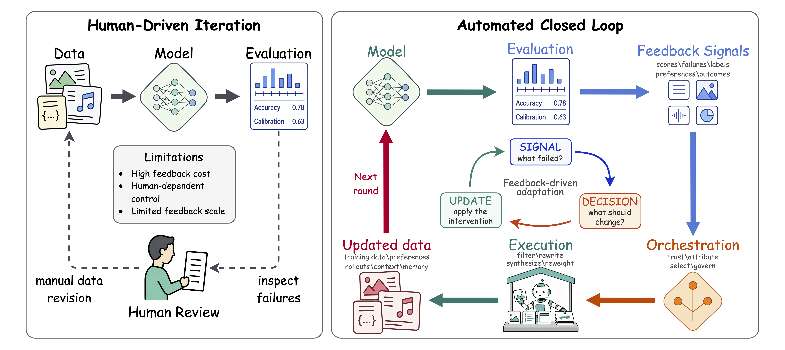
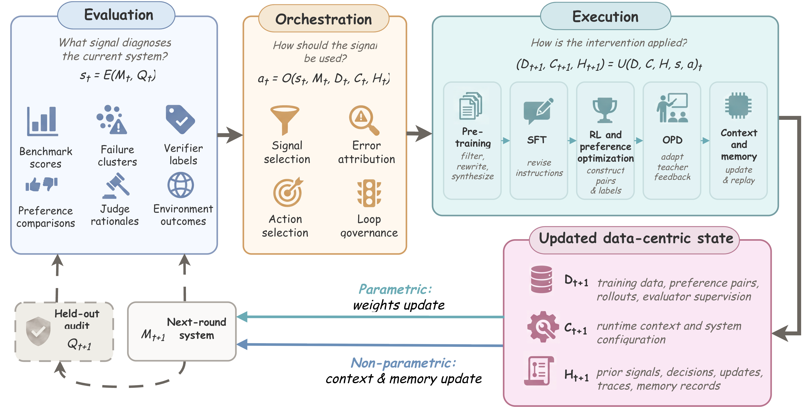
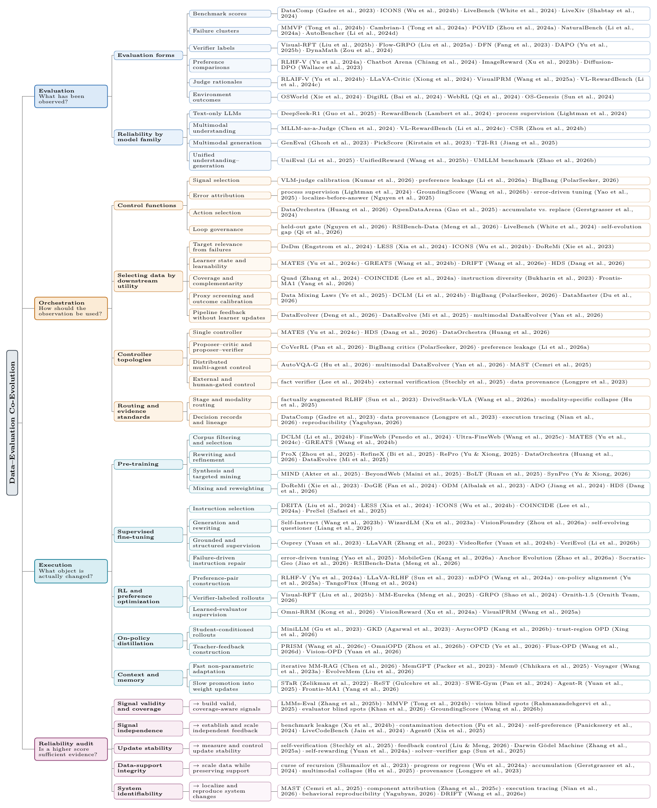

<a id="readme-top"></a>

<div align="center">

# 🔁 Data-Centric Recursive Improvement for Foundation Models: A Survey

<strong>A curated, paper-faithful reading map for <em>data-centric recursive improvement</em>: how
evaluation signals drive data updates that improve foundation models across rounds.</strong>

<p align="center">
  
</p>

<p align="center">
  <a href="#toc"></a>
  <a href="paper/dcri_survey_2026.pdf"></a>
  <a href="https://openreview.net/forum?id=zGqv8Jsh4Y"></a>
  <a href="https://github.com/zoezou2015/Awesome-Data-Centric-Recursive-Improvement"></a>
  <a href="LICENSE"></a>
</p>

<p align="center">
  <a href="#loop">🧭 Loop</a> &nbsp;•&nbsp;
  <a href="#taxonomy">🗂️ Taxonomy</a> &nbsp;•&nbsp;
  <a href="#toc">📚 Browse</a> &nbsp;•&nbsp;
  <a href="CONTRIBUTING.md">🤝 Contribute</a>
</p>

</div>

<p align="center">
  Yanyan Zou, Chao Chen, Tung Sum Thomas Kwok, Jiayu Yang, Yunyun Hou, Jingmin Zhu,<br/>
  Zehang Luo, Shengjie Li, Yinhong Liu, Yingjia Wan, Chengzu Li, Tao Yu,<br/>
  Zhijiang Guo, Jiachen Liu, Sirui Wang, Nan Duan
</p>

<p align="center">
  <sub>JD Future Academy · HKUST (Guangzhou) · UCLA · University of Cambridge · Communication
  University of China · Monash University · Peking University · Institute of Automation, CAS</sub>
</p>

> **Evaluation is not a report card, and data is not a fixed input.**
> Evaluation produces diagnostic signals, **orchestration** decides whether and how those
> signals should be trusted and used, and **execution** updates mutable data-related objects
> that shape the next round of training, adaptation, retrieval, or memory.

This repository is the companion reading map for our survey. It is generated **directly from
the paper source**, so every section below matches a section of the paper and lists the works
actually discussed there.

<!-- omit in toc -->
## 📢 Updates

- **2026.08**: 🎉 Released this repository as the reading map for *Data-Centric Recursive
  Improvement for Foundation Models: A Survey* (**300 cited works**, 2020–2026).
- **2026.08**: 📄 Paper available on [OpenReview](https://openreview.net/forum?id=zGqv8Jsh4Y)
  — or [read the PDF](paper/dcri_survey_2026.pdf) directly.

---

<a id="loop"></a>
<!-- omit in toc -->
## 🧭 The Signal–Decision–Update Loop

Data-centric methods are central to foundation model development, but data construction and
evaluation have long been treated as separate stages. Recent pipelines increasingly couple the
two: evaluation exposes capability gaps and failure modes, which then guide data selection,
filtering, synthesis, and post-training interventions that shape later model versions. We study
this trend as **data-centric recursive improvement**, with **data–evaluation co-evolution** as
its core mechanism, organized around three questions:

| Question | Loop stage | Paper section |
|---|---|---|
| **What signal** diagnoses the current system? |  | [§ Evaluation Signals](#2-evaluation-signals-from-measurement-to-actionable-feedback-65-works) |
| **Who decides** how to act on that signal? |  | [§ Orchestration Decisions](#3-orchestration-decisions-from-feedback-signals-to-data-interventions-70-works) |
| **What object** is updated to affect the next round? |  | [§ Execution Mechanisms](#4-execution-mechanisms-data-centric-updates-across-training-and-adaptation-159-works) |
| **Is a higher score sufficient evidence?** |  | [§ Failure Modes](#5-failure-modes-of-data-evaluation-co-evolution-25-works) · [§ Future Directions](#6-future-directions-57-works) |

<p align="center">
  
</p>

<a id="taxonomy"></a>
<!-- omit in toc -->
## 🗂️ Taxonomy and Reading Map

<p align="center">
  
</p>

Each round is read in four stages: evaluation produces a signal, orchestration turns that signal
into an intervention, execution updates a data-related object, and the audit asks whether a higher
score is actually evidence of improvement. The first three stages follow the survey's main
sections; the audit pairs each reliability requirement (Failure Modes) with its research program
(Future Directions).

> **Note on scope.** Model family (LLM / multimodal understanding / multimodal generation /
> unified understanding–generation) is treated as a **cross-cutting comparison dimension**, not an
> organizing axis — signal reliability and routing differ by family, so those differences are
> discussed inside the relevant sections rather than in separate chapters.

<!-- omit in toc -->
### 🏷️ How to Read the Lists

- Entries are grouped by the **paper (sub)section that discusses them**, newest first.
- Tags show `year` and `venue` (`arXiv` for preprints/technical reports).
- 🔍 means the bibliography has no canonical URL for that entry, so the link is a title
  search — send a PR if you know the canonical link.
- A work may appear under more than one top-level section when the paper discusses it from
  different angles (e.g. once as an evaluation signal, once as an execution mechanism).

---

<a id="toc"></a>
## 📜 Table of Contents
- 📖 [1. Introduction (16 works)](#1-introduction-16-works) `16`
- 🔬 [2. Evaluation Signals: From Measurement to Actionable Feedback (65 works)](#2-evaluation-signals-from-measurement-to-actionable-feedback-65-works) `65`
  - [2.1 Evaluation Forms as Feedback Signals](#21-evaluation-forms-as-feedback-signals)
  - [2.2 Signal Reliability Across Model Types](#22-signal-reliability-across-model-types)
- 🎛️ [3. Orchestration Decisions: From Feedback Signals to Data Interventions (70 works)](#3-orchestration-decisions-from-feedback-signals-to-data-interventions-70-works) `70`
  - [3.1 A Data-Centric Decision Space](#31-a-data-centric-decision-space)
  - [3.2 Selecting Data by Downstream Utility](#32-selecting-data-by-downstream-utility)
  - [3.3 Representative Adaptive Data-Orchestration Systems and Their Recursive Boundaries](#33-representative-adaptive-data-orchestration-systems-and-their-recursive-boundaries)
  - [3.4 Controller Topologies as Implementations](#34-controller-topologies-as-implementations)
  - [3.5 Routing Decisions Across Stages and Model Types](#35-routing-decisions-across-stages-and-model-types)
  - [3.6 Evidence Standards and Auditability](#36-evidence-standards-and-auditability)
- ⚙️ [4. Execution Mechanisms: Data-Centric Updates Across Training and Adaptation (159 works)](#4-execution-mechanisms-data-centric-updates-across-training-and-adaptation-159-works) `159`
  - [4.1 Pre-training: Evaluation-Triggered Data Interventions](#41-pre-training-evaluation-triggered-data-interventions)
  - [4.2 Supervised Finetuning: Evaluation-Guided Instruction Data Construction](#42-supervised-finetuning-evaluation-guided-instruction-data-construction)
  - [4.3 Reinforcement Learning and Preference Optimization](#43-reinforcement-learning-and-preference-optimization)
  - [4.4 On-Policy Distillation from Teacher Feedback](#44-on-policy-distillation-from-teacher-feedback)
  - [4.5 Context and Memory as Data-Centric Adaptation](#45-context-and-memory-as-data-centric-adaptation)
- ⚠️ [5. Failure Modes of Data-Evaluation Co-Evolution (25 works)](#5-failure-modes-of-data-evaluation-co-evolution-25-works) `25`
  - [5.1 Invalid or Incomplete Feedback Signals](#51-invalid-or-incomplete-feedback-signals)
  - [5.2 Dependent or Exposed Feedback Signals](#52-dependent-or-exposed-feedback-signals)
  - [5.3 Unstable Updates and Non-Monotonic Progress](#53-unstable-updates-and-non-monotonic-progress)
  - [5.4 Data-Support Loss under Recursive Generation](#54-data-support-loss-under-recursive-generation)
  - [5.5 Unattributable and Irreproducible System Changes](#55-unattributable-and-irreproducible-system-changes)
- 🚀 [6. Future Directions (57 works)](#6-future-directions-57-works) `57`
  - [6.1 Build Valid, Coverage-Aware Multimodal Signals](#61-build-valid-coverage-aware-multimodal-signals)
  - [6.2 Establish and Scale Independent Feedback](#62-establish-and-scale-independent-feedback)
  - [6.3 Measure and Control Update Stability](#63-measure-and-control-update-stability)
  - [6.4 Scale Data while Preserving Support](#64-scale-data-while-preserving-support)
  - [6.5 Localize and Reproduce System Changes](#65-localize-and-reproduce-system-changes)

---

## 1. Introduction (16 works)

[](#toc) <sub><a href="#toc">↑ back to contents</a></sub>
- [A Survey of Self-Evolving Agents: What, When, How, and Where to Evolve on the Path to Artificial Super Intelligence](https://mlanthology.org/tmlr/2026/gao2026tmlr-survey/) `2026` `TMLR`
- [BigBang: Pursuing Open-Ended Intelligence through Self-Evolving Synthesis of Verifiable Frontier Tasks](https://endlessfrontier.tech/assets/paper.pdf) `2026`
- [DataEvolver: Automatic Data Preparation for Large Language Models through Multi-Level Self-Evolving](https://arxiv.org/abs/2606.07001) `2026` `arXiv`
- [DataOrchestra: Learning to Orchestrate Per-Example Curation of Pretraining Data](https://arxiv.org/abs/2607.24717) `2026` `arXiv`
- [Frontis-MA1: Training an AI4AI Model towards Recursive Self-Improvement in Machine Learning Engineering](https://scholar.google.com/scholar?q=Frontis-MA1%3A+Training+an+AI4AI+Model+towards+Recursive+Self-Improvement+in+Machine+Learning+Engineering) 🔍 `2026` `arXiv`
- [Data Darwinism Part II: DataEvolve - AI Can Autonomously Evolve Pretraining Data Curation](https://scholar.google.com/scholar?q=Data+Darwinism+Part+II%3A+DataEvolve+-+AI+Can+Autonomously+Evolve+Pretraining+Data+Curation) 🔍 `2025` `arXiv`
- [Data Mixing Laws: Optimizing Data Mixtures by Predicting Language Modeling Performance](https://arxiv.org/abs/2403.16952) `2025` `ICLR`
- [Error-driven Data-efficient Large Multimodal Model Tuning](https://arxiv.org/abs/2412.15652) `2025` `ACL`
- [Recent Advances in Large Language Model Benchmarks against Data Contamination: From Static to Dynamic Evaluation](https://scholar.google.com/scholar?q=Recent+Advances+in+Large+Language+Model+Benchmarks+against+Data+Contamination%3A+From+Static+to+Dynamic+Evaluation) 🔍 `2025` `arXiv`
- [A large-scale audit of dataset licensing and attribution in AI](https://doi.org/10.1038/s42256-024-00878-8) `2024` `Nature Machine I…`
- [A Survey on Benchmarks of Multimodal Large Language Models](https://scholar.google.com/scholar?q=A+Survey+on+Benchmarks+of+Multimodal+Large+Language+Models) 🔍 `2024` `arXiv`
- [FineWeb: Decanting the Web for the Finest Text Data at Scale](https://arxiv.org/abs/2406.17557) `2024` `NeurIPS`
- [LESS: Selecting Influential Data for Targeted Instruction Tuning](https://arxiv.org/abs/2402.04333) `2024` `ICML`
- [DataComp: In search of the next generation of multimodal datasets](https://scholar.google.com/scholar?q=DataComp%3A+In+search+of+the+next+generation+of+multimodal+datasets) 🔍 `2023` `NeurIPS`
- [DoReMi: Optimizing Data Mixtures Speeds Up Language Model Pretraining](https://arxiv.org/abs/2305.10429) `2023` `NeurIPS`
- [Datasheets for Datasets](https://scholar.google.com/scholar?q=Datasheets+for+Datasets) 🔍 `2021` `Communications o…`


## 2. Evaluation Signals: From Measurement to Actionable Feedback (65 works)

[](#toc) <sub><a href="#toc">↑ back to contents</a></sub>

> **Evaluation** · what signal diagnoses the current system.


**↪️ Jump to:**<br>
[2.1 Evaluation Forms as Feedback Signals](#21-evaluation-forms-as-feedback-signals) (58)<br>
[2.2 Signal Reliability Across Model Types](#22-signal-reliability-across-model-types) (7)


### 2.1 Evaluation Forms as Feedback Signals

- [Flow-GRPO: Training Flow Matching Models via Online RL](https://proceedings.neurips.cc/paper_files/paper/2025/hash/9ed5598827c66866837632a2d0d8af1c-Abstract-Conference.html) `2025` `NeurIPS`
- [LiveBench: A Challenging, Contamination-Limited LLM Benchmark](https://scholar.google.com/scholar?q=LiveBench%3A+A+Challenging%2C+Contamination-Limited+LLM+Benchmark) 🔍 `2025` `ICLR`
- [LLaVA-Critic: Learning to Evaluate Multimodal Models](https://scholar.google.com/scholar?q=LLaVA-Critic%3A+Learning+to+Evaluate+Multimodal+Models) 🔍 `2025` `CVPR`
- [OS-Genesis: Automating GUI Agent Trajectory Construction via Reverse Task Synthesis](https://aclanthology.org/2025.acl-long.277/) `2025` `ACL`
- [RLAIF-V: Open-Source AI Feedback Leads to Super GPT-4V Trustworthiness](https://openaccess.thecvf.com/content/CVPR2025/html/Yu_RLAIF-V_Open-Source_AI_Feedback_Leads_to_Super_GPT-4V_Trustworthiness_CVPR_2025_paper.html) `2025` `CVPR`
- [Visual-RFT: Visual Reinforcement Fine-Tuning](https://scholar.google.com/scholar?q=Visual-RFT%3A+Visual+Reinforcement+Fine-Tuning) 🔍 `2025` `ICCV`
- [VisualPRM: An Effective Process Reward Model for Multimodal Reasoning](https://scholar.google.com/scholar?q=VisualPRM%3A+An+Effective+Process+Reward+Model+for+Multimodal+Reasoning) 🔍 `2025` `arXiv`
- [Aligning Modalities in Vision Large Language Models via Preference Fine-tuning](https://scholar.google.com/scholar?q=Aligning+Modalities+in+Vision+Large+Language+Models+via+Preference+Fine-tuning) 🔍 `2024` `arXiv`
- [Cambrian-1: A Fully Open, Vision-Centric Exploration of Multimodal LLMs](https://doi.org/10.52202/079017-2771) `2024` `NeurIPS`
- [Chatbot Arena: An Open Platform for Evaluating LLMs by Human Preference](https://scholar.google.com/scholar?q=Chatbot+Arena%3A+An+Open+Platform+for+Evaluating+LLMs+by+Human+Preference) 🔍 `2024` `ICML`
- [DigiRL: Training In-The-Wild Device-Control Agents with Autonomous Reinforcement Learning](https://scholar.google.com/scholar?q=DigiRL%3A+Training+In-The-Wild+Device-Control+Agents+with+Autonomous+Reinforcement+Learning) 🔍 `2024` `NeurIPS`
- [Eyes Wide Shut? Exploring the Visual Shortcomings of Multimodal LLMs](https://scholar.google.com/scholar?q=Eyes+Wide+Shut%3F+Exploring+the+Visual+Shortcomings+of+Multimodal+LLMs) 🔍 `2024` `CVPR`
- [ICONS: Influence Consensus for Vision-Language Data Selection](https://arxiv.org/abs/2501.00654) `2024` `arXiv`
- [NaturalBench: Evaluating Vision-Language Models on Natural Adversarial Samples](https://scholar.google.com/scholar?q=NaturalBench%3A+Evaluating+Vision-Language+Models+on+Natural+Adversarial+Samples) 🔍 `2024` `NeurIPS`
- [OSWorld: Benchmarking Multimodal Agents for Open-Ended Tasks in Real Computer Environments](https://scholar.google.com/scholar?q=OSWorld%3A+Benchmarking+Multimodal+Agents+for+Open-Ended+Tasks+in+Real+Computer+Environments) 🔍 `2024` `NeurIPS`
- [RLHF-V: Towards Trustworthy MLLMs via Behavior Alignment from Fine-grained Correctional Human Feedback](https://scholar.google.com/scholar?q=RLHF-V%3A+Towards+Trustworthy+MLLMs+via+Behavior+Alignment+from+Fine-grained+Correctional+Human+Feedback) 🔍 `2024` `CVPR`
- [DataComp: In search of the next generation of multimodal datasets](https://scholar.google.com/scholar?q=DataComp%3A+In+search+of+the+next+generation+of+multimodal+datasets) 🔍 `2023` `NeurIPS`
- [ImageReward: Learning and Evaluating Human Preferences for Text-to-Image Generation](https://scholar.google.com/scholar?q=ImageReward%3A+Learning+and+Evaluating+Human+Preferences+for+Text-to-Image+Generation) 🔍 `2023` `NeurIPS`


#### Benchmark Scores

- [Less is More: High-value Data Selection for Visual Instruction Tuning](https://arxiv.org/abs/2403.09559) `2025` `ACM MM`
- [LiveXiv - A Multi-Modal Live Benchmark Based on Arxiv Papers Content](https://scholar.google.com/scholar?q=LiveXiv+-+A+Multi-Modal+Live+Benchmark+Based+on+Arxiv+Papers+Content) 🔍 `2025` `ICLR`
- [MMMU-Pro: A More Robust Multi-discipline Multimodal Understanding Benchmark](https://aclanthology.org/2025.acl-long.736/) `2025` `ACL`
- [OCRBench v2: An Improved Benchmark for Evaluating Large Multimodal Models on Visual Text Localization and Reasoning](https://doi.org/10.52202/085713-3253) `2025` `NeurIPS`
- [VBench-2.0: Advancing Video Generation Benchmark Suite for Intrinsic Faithfulness](https://scholar.google.com/scholar?q=VBench-2.0%3A+Advancing+Video+Generation+Benchmark+Suite+for+Intrinsic+Faithfulness) 🔍 `2025` `arXiv`


#### Failure Clusters

- [AutoBencher: Towards Declarative Benchmark Construction](https://scholar.google.com/scholar?q=AutoBencher%3A+Towards+Declarative+Benchmark+Construction) 🔍 `2025` `ICLR`
- [Are We on the Right Way for Evaluating Large Vision-Language Models?](https://scholar.google.com/scholar?q=Are+We+on+the+Right+Way+for+Evaluating+Large+Vision-Language+Models%3F) 🔍 `2024` `NeurIPS`
- [MATHVERSE: Does Your Multi-modal LLM Truly See the Diagrams in Visual Math Problems?](https://doi.org/10.1007/978-3-031-73242-3_10) `2024` `ECCV`
- [Beyond Hallucinations: Enhancing LVLMs through Hallucination-Aware Direct Preference Optimization](https://scholar.google.com/scholar?q=Beyond+Hallucinations%3A+Enhancing+LVLMs+through+Hallucination-Aware+Direct+Preference+Optimization) 🔍 `2023` `arXiv`
- [Dynabench: Rethinking Benchmarking in NLP](https://doi.org/10.18653/v1/2021.naacl-main.324) `2021` `NAACL`


#### Verifier Labels

- [Benchmark Self-Evolving: A Multi-Agent Framework for Dynamic LLM Evaluation](https://scholar.google.com/scholar?q=Benchmark+Self-Evolving%3A+A+Multi-Agent+Framework+for+Dynamic+LLM+Evaluation) 🔍 `2025` `ACL`
- [DAPO: An Open-Source LLM Reinforcement Learning System at Scale](https://doi.org/10.52202/085713-3775) `2025` `NeurIPS`
- [DeepSeek-R1 incentivizes reasoning in LLMs through reinforcement learning](https://doi.org/10.1038/s41586-025-09422-z) `2025` `Nature`
- [DynaMath: A Dynamic Visual Benchmark for Evaluating Mathematical Reasoning Robustness of Vision Language Models](https://scholar.google.com/scholar?q=DynaMath%3A+A+Dynamic+Visual+Benchmark+for+Evaluating+Mathematical+Reasoning+Robustness+of+Vision+Language+Models) 🔍 `2025` `ICLR`
- [MM-Eureka: Exploring the Frontiers of Multimodal Reasoning with Rule-based Reinforcement Learning](https://scholar.google.com/scholar?q=MM-Eureka%3A+Exploring+the+Frontiers+of+Multimodal+Reasoning+with+Rule-based+Reinforcement+Learning) 🔍 `2025` `arXiv`
- [T2I-R1: Reinforcing Image Generation with Collaborative Semantic-level and Token-level CoT](https://papers.neurips.cc/paper_files/paper/2025/hash/38fc6254f73450813db3b3e04397a9fc-Abstract-Conference.html) `2025` `NeurIPS`
- [Data Filtering Networks](https://scholar.google.com/scholar?q=Data+Filtering+Networks) 🔍 `2024` `ICLR`
- [Demystifying CLIP Data](https://scholar.google.com/scholar?q=Demystifying+CLIP+Data) 🔍 `2024` `ICLR`
- [DyVal: Dynamic Evaluation of Large Language Models for Reasoning Tasks](https://scholar.google.com/scholar?q=DyVal%3A+Dynamic+Evaluation+of+Large+Language+Models+for+Reasoning+Tasks) 🔍 `2024` `ICLR`
- [Task Me Anything](https://scholar.google.com/scholar?q=Task+Me+Anything) 🔍 `2024` `NeurIPS`


#### Preference Comparisons

- [Diffusion Model Alignment Using Direct Preference Optimization](https://doi.org/10.1109/CVPR52733.2024.00786) `2024` `CVPR`
- [Enhancing the Reasoning Ability of Multimodal Large Language Models via Mixed Preference Optimization](https://scholar.google.com/scholar?q=Enhancing+the+Reasoning+Ability+of+Multimodal+Large+Language+Models+via+Mixed+Preference+Optimization) 🔍 `2024` `arXiv`
- [WildVision: Evaluating Vision-Language Models in the Wild with Human Preferences](https://scholar.google.com/scholar?q=WildVision%3A+Evaluating+Vision-Language+Models+in+the+Wild+with+Human+Preferences) 🔍 `2024` `NeurIPS`
- [Human Preference Score v2: A Solid Benchmark for Evaluating Human Preferences of Text-to-Image Synthesis](https://scholar.google.com/scholar?q=Human+Preference+Score+v2%3A+A+Solid+Benchmark+for+Evaluating+Human+Preferences+of+Text-to-Image+Synthesis) 🔍 `2023` `arXiv`
- [Pick-a-Pic: An Open Dataset of User Preferences for Text-to-Image Generation](https://scholar.google.com/scholar?q=Pick-a-Pic%3A+An+Open+Dataset+of+User+Preferences+for+Text-to-Image+Generation) 🔍 `2023` `NeurIPS`
- [Silkie: Preference Distillation for Large Visual Language Models](https://scholar.google.com/scholar?q=Silkie%3A+Preference+Distillation+for+Large+Visual+Language+Models) 🔍 `2023` `arXiv`


#### Judge Rationales

- [CMI-RewardBench: Evaluating Music Reward Models with Compositional Multimodal Instruction](https://arxiv.org/abs/2603.00610) `2026` `arXiv`
- [MJ-Bench: Is Your Multimodal Reward Model Really a Good Judge for Text-to-Image Generation?](https://doi.org/10.52202/085713-2081) `2025` `NeurIPS`
- [Multimodal RewardBench: Holistic Evaluation of Reward Models for Vision Language Models](https://scholar.google.com/scholar?q=Multimodal+RewardBench%3A+Holistic+Evaluation+of+Reward+Models+for+Vision+Language+Models) 🔍 `2025` `arXiv`
- [RewardBench: Evaluating Reward Models for Language Modeling](https://scholar.google.com/scholar?q=RewardBench%3A+Evaluating+Reward+Models+for+Language+Modeling) 🔍 `2025` `NAACL`
- [Skywork-VL Reward: An Effective Reward Model for Multimodal Understanding and Reasoning](https://scholar.google.com/scholar?q=Skywork-VL+Reward%3A+An+Effective+Reward+Model+for+Multimodal+Understanding+and+Reasoning) 🔍 `2025` `arXiv`
- [VideoRewardBench: Comprehensive Evaluation of Multimodal Reward Models for Video Understanding](https://arxiv.org/abs/2509.00484) `2025` `arXiv`
- [VL-RewardBench: A Challenging Benchmark for Vision-Language Generative Reward Models](https://openaccess.thecvf.com/content/CVPR2025/html/Li_VL-RewardBench_A_Challenging_Benchmark_for_Vision-Language_Generative_Reward_Models_CVPR_2025_paper.html) `2025` `CVPR`
- [Calibrated Self-Rewarding Vision Language Models](https://scholar.google.com/scholar?q=Calibrated+Self-Rewarding+Vision+Language+Models) 🔍 `2024` `NeurIPS`
- [MLLM-as-a-Judge: Assessing Multimodal LLM-as-a-Judge with Vision-Language Benchmark](https://scholar.google.com/scholar?q=MLLM-as-a-Judge%3A+Assessing+Multimodal+LLM-as-a-Judge+with+Vision-Language+Benchmark) 🔍 `2024` `ICML`
- [Prometheus-Vision: Vision-Language Model as a Judge for Fine-Grained Evaluation](https://scholar.google.com/scholar?q=Prometheus-Vision%3A+Vision-Language+Model+as+a+Judge+for+Fine-Grained+Evaluation) 🔍 `2024` `ACL`
- [Self-Rewarding Language Models](https://scholar.google.com/scholar?q=Self-Rewarding+Language+Models) 🔍 `2024` `ICML`


#### Environment Outcomes

- [AndroidWorld: A Dynamic Benchmarking Environment for Autonomous Agents](https://scholar.google.com/scholar?q=AndroidWorld%3A+A+Dynamic+Benchmarking+Environment+for+Autonomous+Agents) 🔍 `2025` `ICLR`
- [WebRL: Training LLM Web Agents via Self-Evolving Online Curriculum Reinforcement Learning](https://scholar.google.com/scholar?q=WebRL%3A+Training+LLM+Web+Agents+via+Self-Evolving+Online+Curriculum+Reinforcement+Learning) 🔍 `2025` `ICLR`
- [VisualWebArena: Evaluating Multimodal Agents on Realistic Visual Web Tasks](https://scholar.google.com/scholar?q=VisualWebArena%3A+Evaluating+Multimodal+Agents+on+Realistic+Visual+Web+Tasks) 🔍 `2024` `ACL`


### 2.2 Signal Reliability Across Model Types


**Text-only LLMs**

- [Let's Verify Step by Step](https://arxiv.org/abs/2305.20050) `2024` `ICLR`


**Multimodal generation models**

- [Evaluating Text-to-Visual Generation with Image-to-Text Generation](https://scholar.google.com/scholar?q=Evaluating+Text-to-Visual+Generation+with+Image-to-Text+Generation) 🔍 `2024` `ECCV`
- [GenAI-Bench: Evaluating and Improving Compositional Text-to-Visual Generation](https://scholar.google.com/scholar?q=GenAI-Bench%3A+Evaluating+and+Improving+Compositional+Text-to-Visual+Generation) 🔍 `2024` `arXiv`
- [GenEval: An Object-Focused Framework for Evaluating Text-to-Image Alignment](https://scholar.google.com/scholar?q=GenEval%3A+An+Object-Focused+Framework+for+Evaluating+Text-to-Image+Alignment) 🔍 `2023` `NeurIPS`


**Unified understanding-generation models**

- [Fair in Mind, Fair in Action? A Synchronous Benchmark for Understanding and Generation in UMLLMs](https://scholar.google.com/scholar?q=Fair+in+Mind%2C+Fair+in+Action%3F+A+Synchronous+Benchmark+for+Understanding+and+Generation+in+UMLLMs) 🔍 `2026` `arXiv`
- [UniEval: Unified Holistic Evaluation for Unified Multimodal Understanding and Generation](https://scholar.google.com/scholar?q=UniEval%3A+Unified+Holistic+Evaluation+for+Unified+Multimodal+Understanding+and+Generation) 🔍 `2025` `arXiv`
- [Unified Reward Model for Multimodal Understanding and Generation](https://scholar.google.com/scholar?q=Unified+Reward+Model+for+Multimodal+Understanding+and+Generation) 🔍 `2025` `arXiv`


## 3. Orchestration Decisions: From Feedback Signals to Data Interventions (70 works)

[](#toc) <sub><a href="#toc">↑ back to contents</a></sub>

> **Orchestration** · who decides how to act on the signal.


**↪️ Jump to:**<br>
[3.1 A Data-Centric Decision Space](#31-a-data-centric-decision-space) (24)<br>
[3.2 Selecting Data by Downstream Utility](#32-selecting-data-by-downstream-utility) (25)<br>
[3.3 Representative Adaptive Data-Orchestration Systems and Their Recursive Boundaries](#33-representative-adaptive-data-orchestration-systems-and-their-recursive-boundaries) (1)<br>
[3.4 Controller Topologies as Implementations](#34-controller-topologies-as-implementations) (10)<br>
[3.5 Routing Decisions Across Stages and Model Types](#35-routing-decisions-across-stages-and-model-types) (3)<br>
[3.6 Evidence Standards and Auditability](#36-evidence-standards-and-auditability) (3)

- [A Survey of Self-Evolving Agents: What, When, How, and Where to Evolve on the Path to Artificial Super Intelligence](https://mlanthology.org/tmlr/2026/gao2026tmlr-survey/) `2026` `TMLR`
- [DataMaster: Data-Centric Autonomous AI Research](https://scholar.google.com/scholar?q=DataMaster%3A+Data-Centric+Autonomous+AI+Research) 🔍 `2026` `arXiv`
- [DataOrchestra: Learning to Orchestrate Per-Example Curation of Pretraining Data](https://arxiv.org/abs/2607.24717) `2026` `arXiv`
- [Self-Improvement in Multimodal Large Language Models: A Survey](https://scholar.google.com/scholar?q=Self-Improvement+in+Multimodal+Large+Language+Models%3A+A+Survey) 🔍 `2025` `EMNLP`


### 3.1 A Data-Centric Decision Space

- [BigBang: Pursuing Open-Ended Intelligence through Self-Evolving Synthesis of Verifiable Frontier Tasks](https://endlessfrontier.tech/assets/paper.pdf) `2026`


#### Signal Selection: Building a Decision-Grade Evidence Set

- [Omni-RRM: Advancing Omni Reward Modeling via Automatic Rubric-Grounded Preference Synthesis](https://arxiv.org/abs/2602.00846) `2026` `arXiv`
- [Preference Leakage: A Contamination Problem in LLM-as-a-judge](https://arxiv.org/abs/2502.01534) `2026` `ICLR`
- [VLM Judges Can Rank but Cannot Score: Task-Dependent Uncertainty in Multimodal Evaluation](https://scholar.google.com/scholar?q=VLM+Judges+Can+Rank+but+Cannot+Score%3A+Task-Dependent+Uncertainty+in+Multimodal+Evaluation) 🔍 `2026` `arXiv`
- [Let's Verify Step by Step](https://arxiv.org/abs/2305.20050) `2024` `ICLR`
- [Scaling Laws for Reward Model Overoptimization](https://scholar.google.com/scholar?q=Scaling+Laws+for+Reward+Model+Overoptimization) 🔍 `2023` `ICML`
- [Dynabench: Rethinking Benchmarking in NLP](https://doi.org/10.18653/v1/2021.naacl-main.324) `2021` `NAACL`


#### Error Attribution: From Failure to Data Demand

- [Grounding the Score: Explicit Visual Premise Verification for Reliable Vision-Language Process Reward Models](https://scholar.google.com/scholar?q=Grounding+the+Score%3A+Explicit+Visual+Premise+Verification+for+Reliable+Vision-Language+Process+Reward+Models) 🔍 `2026` `arXiv`
- [Learning from Reasoning Failures via Synthetic Data Generation](https://scholar.google.com/scholar?q=Learning+from+Reasoning+Failures+via+Synthetic+Data+Generation) 🔍 `2026` `AAAI`
- [Error-driven Data-efficient Large Multimodal Model Tuning](https://arxiv.org/abs/2412.15652) `2025` `ACL`
- [Localizing Before Answering: A Benchmark for Grounded Medical Visual Question Answering](https://doi.org/10.24963/ijcai.2025/853) `2025` `Proceedings of t…`
- [Self-Evolving Visual Concept Library using Vision-Language Critics](https://scholar.google.com/scholar?q=Self-Evolving+Visual+Concept+Library+using+Vision-Language+Critics) 🔍 `2025` `arXiv`
- [Which Agent Causes Task Failures and When? On Automated Failure Attribution of LLM Multi-Agent Systems](https://scholar.google.com/scholar?q=Which+Agent+Causes+Task+Failures+and+When%3F+On+Automated+Failure+Attribution+of+LLM+Multi-Agent+Systems) 🔍 `2025` `ICML`
- [DataComp: In search of the next generation of multimodal datasets](https://scholar.google.com/scholar?q=DataComp%3A+In+search+of+the+next+generation+of+multimodal+datasets) 🔍 `2023` `NeurIPS`


#### Action Selection: Choosing the Data Object, Operator, and Allocation

- [Closing the Data Loop: Using OpenDataArena to Engineer Superior Training Datasets](https://scholar.google.com/scholar?q=Closing+the+Data+Loop%3A+Using+OpenDataArena+to+Engineer+Superior+Training+Datasets) 🔍 `2025` `arXiv`
- [Filter Images First, Generate Instructions Later: Pre-Instruction Data Selection for Visual Instruction Tuning](https://arxiv.org/abs/2503.07591) `2025` `CVPR`
- [GRAPE: Optimize Data Mixture for Group Robust Multi-target Adaptive Pretraining](https://arxiv.org/abs/2505.20380) `2025` `NeurIPS`
- [Multimodal Synthetic Data Finetuning and Model Collapse: Insights from VLMs and Diffusion Models](https://scholar.google.com/scholar?q=Multimodal+Synthetic+Data+Finetuning+and+Model+Collapse%3A+Insights+from+VLMs+and+Diffusion+Models) 🔍 `2025` `Proceedings of t…`
- [Is Model Collapse Inevitable? Breaking the Curse of Recursion by Accumulating Real and Synthetic Data](https://scholar.google.com/scholar?q=Is+Model+Collapse+Inevitable%3F+Breaking+the+Curse+of+Recursion+by+Accumulating+Real+and+Synthetic+Data) 🔍 `2024` `COLM`


#### Loop Governance: Acceptance, Stopping, and Rollback

- [On the Generalization Gap in Self-Evolving Language Model Reasoning](https://scholar.google.com/scholar?q=On+the+Generalization+Gap+in+Self-Evolving+Language+Model+Reasoning) 🔍 `2026` `arXiv`
- [Recursive Self-Evolving Agents via Held-Out Selection](https://arxiv.org/abs/2606.28374) `2026` `arXiv`
- [RSIBench-Data: Benchmarking Data-Centric Research for Recursive Self-Improvement](https://scholar.google.com/scholar?q=RSIBench-Data%3A+Benchmarking+Data-Centric+Research+for+Recursive+Self-Improvement) 🔍 `2026` `arXiv`
- [LiveBench: A Challenging, Contamination-Limited LLM Benchmark](https://scholar.google.com/scholar?q=LiveBench%3A+A+Challenging%2C+Contamination-Limited+LLM+Benchmark) 🔍 `2025` `ICLR`
- [The Leaderboard Illusion](https://doi.org/10.52202/085713-2620) `2025` `NeurIPS`


### 3.2 Selecting Data by Downstream Utility

- [Data Mixing Laws: Optimizing Data Mixtures by Predicting Language Modeling Performance](https://arxiv.org/abs/2403.16952) `2025` `ICLR`
- [Data Selection via Optimal Control for Language Models](https://arxiv.org/abs/2410.07064) `2025` `ICLR`
- [A large-scale audit of dataset licensing and attribution in AI](https://doi.org/10.1038/s42256-024-00878-8) `2024` `Nature Machine I…`
- [DsDm: Model-Aware Dataset Selection with Datamodels](https://scholar.google.com/scholar?q=DsDm%3A+Model-Aware+Dataset+Selection+with+Datamodels) 🔍 `2024` `ICML`
- [LESS: Selecting Influential Data for Targeted Instruction Tuning](https://arxiv.org/abs/2402.04333) `2024` `ICML`


#### Target Relevance from Downstream Failures

- [ICONS: Influence Consensus for Vision-Language Data Selection](https://arxiv.org/abs/2501.00654) `2024` `arXiv`
- [DoReMi: Optimizing Data Mixtures Speeds Up Language Model Pretraining](https://arxiv.org/abs/2305.10429) `2023` `NeurIPS`


#### Learner State, Difficulty, and Marginal Learnability

- [A Task-Centric Theory for Iterative Self-Improvement with Easy-to-Hard Curricula](https://scholar.google.com/scholar?q=A+Task-Centric+Theory+for+Iterative+Self-Improvement+with+Easy-to-Hard+Curricula) 🔍 `2026` `ICLR`
- [DRIFT: Refining Instruction Data via On-Policy Data Attribution](https://scholar.google.com/scholar?q=DRIFT%3A+Refining+Instruction+Data+via+On-Policy+Data+Attribution) 🔍 `2026` `arXiv`
- [Holistic Data Scheduler for LLM Pre-training via Multi-Objective Reinforcement Learning](http://dx.doi.org/10.1145/3770854.3780325) `2026` `KDD`
- [Learning with Challenges: Adaptive Difficulty-Aware Data Generation for Mobile GUI Agent Training](https://arxiv.org/abs/2601.22781) `2026` `arXiv`
- [Ouroboros-Spatial: Closing the Data-Model Loop for Spatial Reasoning](https://arxiv.org/abs/2606.11719) `2026` `arXiv`
- [Adaptive Data Optimization: Dynamic Sample Selection with Scaling Laws](https://arxiv.org/abs/2410.11820) `2025` `ICLR`
- [WebRL: Training LLM Web Agents via Self-Evolving Online Curriculum Reinforcement Learning](https://scholar.google.com/scholar?q=WebRL%3A+Training+LLM+Web+Agents+via+Self-Evolving+Online+Curriculum+Reinforcement+Learning) 🔍 `2025` `ICLR`
- [Greats: Online selection of high-quality data for llm training in every iteration](https://scholar.google.com/scholar?q=Greats%3A+Online+selection+of+high-quality+data+for+llm+training+in+every+iteration) 🔍 `2024` `NeurIPS`
- [MATES: Model-Aware Data Selection for Efficient Pretraining with Data Influence Models](https://arxiv.org/abs/2406.06046) `2024` `NeurIPS`


#### Coverage, Complementarity, and Exploration

- [Frontis-MA1: Training an AI4AI Model towards Recursive Self-Improvement in Machine Learning Engineering](https://scholar.google.com/scholar?q=Frontis-MA1%3A+Training+an+AI4AI+Model+towards+Recursive+Self-Improvement+in+Machine+Learning+Engineering) 🔍 `2026` `arXiv`
- [Group-Level Data Selection for Efficient Pretraining](https://arxiv.org/abs/2502.14709) `2025` `NeurIPS`
- [Harnessing Diversity for Important Data Selection in Pretraining Large Language Models](https://arxiv.org/abs/2409.16986) `2025` `ICLR`
- [Concept-skill Transferability-based Data Selection for Large Vision-Language Models](https://arxiv.org/abs/2406.10995) `2024` `EMNLP`
- [Data Diversity Matters for Robust Instruction Tuning](https://arxiv.org/abs/2311.14736) `2024` `EMNLP`


#### Proxy Screening and Outcome Calibration

- [DataComp-LM: In search of the next generation of training sets for language models](https://doi.org/10.52202/079017-0455) `2024` `NeurIPS`


#### Pipeline-Level Feedback without Full Learner Updates

- [DataEvolver: Automatic Data Preparation for Large Language Models through Multi-Level Self-Evolving](https://arxiv.org/abs/2606.07001) `2026` `arXiv`
- [Data Darwinism Part II: DataEvolve - AI Can Autonomously Evolve Pretraining Data Curation](https://scholar.google.com/scholar?q=Data+Darwinism+Part+II%3A+DataEvolve+-+AI+Can+Autonomously+Evolve+Pretraining+Data+Curation) 🔍 `2025` `arXiv`
- [Data-Juicer: A One-Stop Data Processing System for Large Language Models](https://scholar.google.com/scholar?q=Data-Juicer%3A+A+One-Stop+Data+Processing+System+for+Large+Language+Models) 🔍 `2024` `Companion of the…`


### 3.3 Representative Adaptive Data-Orchestration Systems and Their Recursive Boundaries

- [DataEvolver: Self-Evolving Multi-Agent Data Construction for Text-Rich Image Generation](https://arxiv.org/abs/2606.31537) `2026` `arXiv`


### 3.4 Controller Topologies as Implementations

- [Why Do Multi-Agent LLM Systems Fail?](https://scholar.google.com/scholar?q=Why+Do+Multi-Agent+LLM+Systems+Fail%3F) 🔍 `2025` `NeurIPS`
- [Self-Rewarding Language Models](https://scholar.google.com/scholar?q=Self-Rewarding+Language+Models) 🔍 `2024` `ICML`
- [Constitutional AI: Harmlessness from AI Feedback](https://scholar.google.com/scholar?q=Constitutional+AI%3A+Harmlessness+from+AI+Feedback) 🔍 `2022` `arXiv`
- [Training Language Models to Follow Instructions with Human Feedback](https://scholar.google.com/scholar?q=Training+Language+Models+to+Follow+Instructions+with+Human+Feedback) 🔍 `2022` `NeurIPS`


#### Proposer-Critic and Proposer-Verifier Separation

- [CoVerRL: Breaking the Consensus Trap in Label-Free Reasoning via Generator-Verifier Co-Evolution](https://aclanthology.org/2026.acl-long.1376/) `2026` `ACL`


#### Distributed and Multi-Agent Control

- [AutoVQA-G: Self-Improving Agentic Framework for Automated Visual Question Answering and Grounding Annotation](https://scholar.google.com/scholar?q=AutoVQA-G%3A+Self-Improving+Agentic+Framework+for+Automated+Visual+Question+Answering+and+Grounding+Annotation) 🔍 `2026` `arXiv`


#### External and Human-Gated Control

- [OmniOPD: Logit-Free On-Policy Distillation via Speculative Verification](https://scholar.google.com/scholar?q=OmniOPD%3A+Logit-Free+On-Policy+Distillation+via+Speculative+Verification) 🔍 `2026` `arXiv`
- [Confirmation bias: A challenge for scalable oversight](https://scholar.google.com/scholar?q=Confirmation+bias%3A+A+challenge+for+scalable+oversight) 🔍 `2025` `arXiv`
- [On the Self-Verification Limitations of Large Language Models on Reasoning and Planning Tasks](https://proceedings.iclr.cc/paper_files/paper/2025/hash/f3c5e56274140e0420baa3916c529210-Abstract-Conference.html) `2025` `ICLR`
- [How to Train Your Fact Verifier: Knowledge Transfer with Multimodal Open Models](https://scholar.google.com/scholar?q=How+to+Train+Your+Fact+Verifier%3A+Knowledge+Transfer+with+Multimodal+Open+Models) 🔍 `2024` `EMNLP`


### 3.5 Routing Decisions Across Stages and Model Types


#### Stage-Specific Data Destinations

- [Iterative Multimodal Retrieval-Augmented Generation for Medical Question Answering](https://scholar.google.com/scholar?q=Iterative+Multimodal+Retrieval-Augmented+Generation+for+Medical+Question+Answering) 🔍 `2026` `arXiv`
- [Aligning Large Multimodal Models with Factually Augmented RLHF](https://doi.org/10.18653/v1/2024.findings-acl.775) `2024` `ACL`


#### Modality-Specific Evidence and Data Granularity

- [DriveStack-VLA: Render-Teacher Alignment for BEV-Based DeepStack Vision-Language-Action Model](https://scholar.google.com/scholar?q=DriveStack-VLA%3A+Render-Teacher+Alignment+for+BEV-Based+DeepStack+Vision-Language-Action+Model) 🔍 `2026` `arXiv`


### 3.6 Evidence Standards and Auditability

- [How Consistent Are LLM Agents? Measuring Behavioral Reproducibility in Multi-Step Tool-Calling Pipelines](https://arxiv.org/abs/2605.28840) `2026` `arXiv`
- [When Only the Final Text Survives: Implicit Execution Tracing for Multi-Agent Attribution](https://scholar.google.com/scholar?q=When+Only+the+Final+Text+Survives%3A+Implicit+Execution+Tracing+for+Multi-Agent+Attribution) 🔍 `2026` `arXiv`
- [Datasheets for Datasets](https://scholar.google.com/scholar?q=Datasheets+for+Datasets) 🔍 `2021` `Communications o…`


## 4. Execution Mechanisms: Data-Centric Updates Across Training and Adaptation (159 works)

[](#toc) <sub><a href="#toc">↑ back to contents</a></sub>

> **Execution** · what object is updated to affect the next round.


**↪️ Jump to:**<br>
[4.1 Pre-training: Evaluation-Triggered Data Interventions](#41-pre-training-evaluation-triggered-data-interventions) (48)<br>
[4.2 Supervised Finetuning: Evaluation-Guided Instruction Data Construction](#42-supervised-finetuning-evaluation-guided-instruction-data-construction) (24)<br>
[4.3 Reinforcement Learning and Preference Optimization](#43-reinforcement-learning-and-preference-optimization) (29)<br>
[4.4 On-Policy Distillation from Teacher Feedback](#44-on-policy-distillation-from-teacher-feedback) (11)<br>
[4.5 Context and Memory as Data-Centric Adaptation](#45-context-and-memory-as-data-centric-adaptation) (34)

- [AutoVQA-G: Self-Improving Agentic Framework for Automated Visual Question Answering and Grounding Annotation](https://scholar.google.com/scholar?q=AutoVQA-G%3A+Self-Improving+Agentic+Framework+for+Automated+Visual+Question+Answering+and+Grounding+Annotation) 🔍 `2026` `arXiv`
- [Learning with Challenges: Adaptive Difficulty-Aware Data Generation for Mobile GUI Agent Training](https://arxiv.org/abs/2601.22781) `2026` `arXiv`
- [RegMix-D: Dynamic Data Mixing via Proxy Training Trajectories](https://arxiv.org/abs/2606.18663) `2026` `arXiv`
- [Self-Evolving Visual Questioner](https://arxiv.org/abs/2606.13929) `2026` `arXiv`
- [Socratic-Geo: Synthetic Data Generation and Cross-Modal Geometric Reasoning via Multi-Agent Interaction](https://scholar.google.com/scholar?q=Socratic-Geo%3A+Synthetic+Data+Generation+and+Cross-Modal+Geometric+Reasoning+via+Multi-Agent+Interaction) 🔍 `2026` `CVPR`
- [VisionFoundry: Teaching VLMs Visual Perception with Synthetic Images](https://arxiv.org/abs/2604.09531) `2026` `arXiv`
- [Adaptive Data Optimization: Dynamic Sample Selection with Scaling Laws](https://arxiv.org/abs/2410.11820) `2025` `ICLR`
- [Data Darwinism Part II: DataEvolve - AI Can Autonomously Evolve Pretraining Data Curation](https://scholar.google.com/scholar?q=Data+Darwinism+Part+II%3A+DataEvolve+-+AI+Can+Autonomously+Evolve+Pretraining+Data+Curation) 🔍 `2025` `arXiv`
- [Group-Level Data Selection for Efficient Pretraining](https://arxiv.org/abs/2502.14709) `2025` `NeurIPS`
- [Ultra-FineWeb: Efficient Data Filtering and Verification for High-Quality LLM Training Data](https://scholar.google.com/scholar?q=Ultra-FineWeb%3A+Efficient+Data+Filtering+and+Verification+for+High-Quality+LLM+Training+Data) 🔍 `2025` `arXiv`
- [LESS: Selecting Influential Data for Targeted Instruction Tuning](https://arxiv.org/abs/2402.04333) `2024` `ICML`
- [MATES: Model-Aware Data Selection for Efficient Pretraining with Data Influence Models](https://arxiv.org/abs/2406.06046) `2024` `NeurIPS`
- [What Makes Good Data for Alignment? A Comprehensive Study of Automatic Data Selection in Instruction Tuning](https://arxiv.org/abs/2312.15685) `2024` `ICLR`


### 4.1 Pre-training: Evaluation-Triggered Data Interventions


#### Corpus filtering and selection

- [BLADE: Scalable Bi-level Adaptive Data Selection for LLM Training](https://arxiv.org/abs/2606.18650) `2026` `arXiv`
- [Cram Less to Fit More: Training Data Pruning Improves Memorization of Facts](https://arxiv.org/abs/2604.08519) `2026` `arXiv`
- [DataComp-VLM: Improved Open Datasets for Vision-Language Models](https://arxiv.org/abs/2606.28551) `2026` `arXiv`
- [OPUS: Towards Efficient and Principled Data Selection in Large Language Model Pre-training in Every Iteration](https://arxiv.org/abs/2602.05400) `2026` `arXiv`
- [Toward Cross-Lingual Quality Classifiers for Multilingual Pretraining Data Selection](https://arxiv.org/abs/2604.20549) `2026` `arXiv`
- [Data Selection via Optimal Control for Language Models](https://arxiv.org/abs/2410.07064) `2025` `ICLR`
- [Language Models Improve When Pretraining Data Matches Target Tasks](https://arxiv.org/abs/2507.12466) `2025` `arXiv`
- [Layer-Aware Influence for Online Data Valuation Estimation](https://arxiv.org/abs/2510.16007) `2025` `arXiv`
- [Meta-rater: A Multi-dimensional Data Selection Method for Pre-training Language Models](https://arxiv.org/abs/2504.14194) `2025` `ACL`
- [DataComp-LM: In search of the next generation of training sets for language models](https://doi.org/10.52202/079017-0455) `2024` `NeurIPS`
- [FineWeb: Decanting the Web for the Finest Text Data at Scale](https://arxiv.org/abs/2406.17557) `2024` `NeurIPS`
- [Greats: Online selection of high-quality data for llm training in every iteration](https://scholar.google.com/scholar?q=Greats%3A+Online+selection+of+high-quality+data+for+llm+training+in+every+iteration) 🔍 `2024` `NeurIPS`
- [QuRating: Selecting High-Quality Data for Training Language Models](https://arxiv.org/abs/2402.09739) `2024` `ICML`


#### Data rewriting and refinement

- [Beyond Captions: Context-Grounded Reconstruction for Biomedical Multimodal Continued Pretraining](https://arxiv.org/abs/2606.01049) `2026` `arXiv`
- [DataOrchestra: Learning to Orchestrate Per-Example Curation of Pretraining Data](https://arxiv.org/abs/2607.24717) `2026` `arXiv`
- [Rewriting Pre-Training Data Boosts LLM Performance in Math and Code](https://arxiv.org/abs/2505.02881) `2026` `ICLR`
- [Programming Every Example: Lifting Pre-training Data Quality Like Experts at Scale](https://arxiv.org/abs/2409.17115) `2025` `ICML`
- [Recycling the Web: A Method to Enhance Pre-training Data Quality and Quantity for Language Models](https://arxiv.org/abs/2506.04689) `2025` `COLM`
- [RefineX: Learning to Refine Pre-training Data at Scale from Expert-Guided Programs](https://arxiv.org/abs/2507.03253) `2025` `arXiv`
- [RePro: Training Language Models to Faithfully Recycle the Web for Pretraining](https://arxiv.org/abs/2510.10681) `2025` `arXiv`
- [Beyond Filtering: Adaptive Image-Text Quality Enhancement for MLLM Pretraining](https://arxiv.org/abs/2410.16166) `2024` `arXiv`
- [Robustifying Safety-Aligned Large Language Models through Clean Data Curation](https://arxiv.org/abs/2405.19358) `2024` `arXiv`


#### Data synthesis and targeted mining

- [Generating Pretraining Tokens from Organic Data for Data-Bound Scaling](https://arxiv.org/abs/2605.17849) `2026` `arXiv`
- [How Can We Synthesize High-Quality Pretraining Data? A Systematic Study of Prompt Design, Generator Model, and Source Data](https://arxiv.org/abs/2604.13977) `2026` `arXiv`
- [Self-Improving Pretraining: using post-trained models to pretrain better models](https://arxiv.org/abs/2601.21343) `2026` `arXiv`
- [Towards robust long-context understanding of large language model via active recap learning](https://arxiv.org/abs/2601.13734) `2026` `arXiv`
- [WRAP++: Web discoveRy Amplified Pretraining](https://arxiv.org/abs/2604.06829) `2026` `arXiv`
- [BeyondWeb: Lessons from Scaling Synthetic Data for Trillion-scale Pretraining](https://arxiv.org/abs/2508.10975) `2025` `arXiv`
- [MIND: Math Informed syNthetic Dialogues for Pretraining LLMs](https://arxiv.org/abs/2410.12881) `2025` `ICLR`
- [Reasoning to Learn from Latent Thoughts](https://arxiv.org/abs/2503.18866) `2025` `arXiv`
- [Scaling Speech-Text Pre-training with Synthetic Interleaved Data](https://arxiv.org/abs/2411.17607) `2025` `ICLR`
- [DoPAMine: Domain-specific Pre-training Adaptation from seed-guided data Mining](https://arxiv.org/abs/2410.00260) `2024` `arXiv`


#### Data mixing and reweighting

- [AC-ODM: Actor-Critic Online Data Mixing for Sample-Efficient LLM Pretraining](https://arxiv.org/abs/2505.23878) `2026` `ICML`
- [Always Learning, Always Mixing: Efficient and Simple Data Mixing All The Time](https://arxiv.org/abs/2605.15220) `2026` `arXiv`
- [Data Mixing Agent: Learning to Re-weight Domains for Continual Pre-training](https://arxiv.org/abs/2507.15640) `2026` `ACL`
- [Holistic Data Scheduler for LLM Pre-training via Multi-Objective Reinforcement Learning](http://dx.doi.org/10.1145/3770854.3780325) `2026` `KDD`
- [Aioli: A Unified Optimization Framework for Language Model Data Mixing](https://arxiv.org/abs/2411.05735) `2025` `ICLR`
- [Data Mixing Laws: Optimizing Data Mixtures by Predicting Language Modeling Performance](https://arxiv.org/abs/2403.16952) `2025` `ICLR`
- [GRAPE: Optimize Data Mixture for Group Robust Multi-target Adaptive Pretraining](https://arxiv.org/abs/2505.20380) `2025` `NeurIPS`
- [Nemotron-CLIMB: Clustering-based Iterative Data Mixture Bootstrapping for Language Model Pre-training](https://arxiv.org/abs/2504.13161) `2025` `NeurIPS`
- [PiKE: Adaptive Data Mixing for Large-Scale Multi-Task Learning Under Low Gradient Conflicts](https://arxiv.org/abs/2502.06244) `2025` `arXiv`
- [RegMix: Data Mixture as Regression for Language Model Pre-training](https://arxiv.org/abs/2407.01492) `2025` `ICLR`
- [TiKMiX: Take Data Influence into Dynamic Mixture for Language Model Pre-training](https://arxiv.org/abs/2508.17677) `2025` `arXiv`
- [Velocitune: A Velocity-based Dynamic Domain Reweighting Method for Continual Pre-training](https://arxiv.org/abs/2411.14318) `2025` `ACL`
- [DOGE: Domain Reweighting with Generalization Estimation](https://arxiv.org/abs/2310.15393) `2024` `ICML`
- [Dynamic Gradient Alignment for Online Data Mixing](https://arxiv.org/abs/2410.02498) `2024` `arXiv`
- [DoReMi: Optimizing Data Mixtures Speeds Up Language Model Pretraining](https://arxiv.org/abs/2305.10429) `2023` `NeurIPS`
- [Efficient Online Data Mixing For Language Model Pre-Training](https://arxiv.org/abs/2312.02406) `2023` `arXiv`


### 4.2 Supervised Finetuning: Evaluation-Guided Instruction Data Construction


#### Instruction Selection as a Data-Update Operator

- [ScalSelect: Scalable Training-Free Multimodal Data Selection for Efficient Visual Instruction Tuning](https://arxiv.org/abs/2602.11636) `2026` `arXiv`
- [Align2LLaVA: Cascaded Human and Large Language Model Preference Alignment for Multi-modal Instruction Curation](http://dx.doi.org/10.18653/v1/2025.findings-acl.458) `2025` `ACL`
- [Filter Images First, Generate Instructions Later: Pre-Instruction Data Selection for Visual Instruction Tuning](https://arxiv.org/abs/2503.07591) `2025` `CVPR`
- [Less is More: High-value Data Selection for Visual Instruction Tuning](https://arxiv.org/abs/2403.09559) `2025` `ACM MM`
- [Concept-skill Transferability-based Data Selection for Large Vision-Language Models](https://arxiv.org/abs/2406.10995) `2024` `EMNLP`
- [Data Diversity Matters for Robust Instruction Tuning](https://arxiv.org/abs/2311.14736) `2024` `EMNLP`
- [ICONS: Influence Consensus for Vision-Language Data Selection](https://arxiv.org/abs/2501.00654) `2024` `arXiv`


#### Instruction Generation and Rewriting

- [Video-LLaVA: Learning United Visual Representation by Alignment Before Projection](https://arxiv.org/abs/2311.10122) `2024` `EMNLP`
- [WizardLM: Empowering Large Pre-Trained Language Models to Follow Complex Instructions](https://scholar.google.com/scholar?q=WizardLM%3A+Empowering+Large+Pre-Trained+Language+Models+to+Follow+Complex+Instructions) 🔍 `2024` `ICLR`
- [X-InstructBLIP: A Framework for Aligning Image, 3D, Audio, Video to LLMs and its Emergent Cross-modal Reasoning](https://arxiv.org/abs/2311.18799) `2024` `ECCV`
- [Self-Instruct: Aligning Language Models with Self-Generated Instructions](https://scholar.google.com/scholar?q=Self-Instruct%3A+Aligning+Language+Models+with+Self-Generated+Instructions) 🔍 `2023` `ACL`


#### Grounded and Structured Supervision

- [Chain-of-Frames: Advancing Video Understanding in Multimodal LLMs via Frame-Aware Reasoning](https://arxiv.org/abs/2506.00318) `2026` `CVPR`
- [VeriEvol: Scaling Multimodal Mathematical Reasoning via Verifiable Evol-Instruct](https://arxiv.org/abs/2606.23543) `2026` `arXiv`
- [ChartGen: Scaling Chart Understanding Via Code-Guided Synthetic Chart Generation](https://arxiv.org/abs/2507.19492) `2025` `arXiv`
- [Draw-and-Understand: Leveraging Visual Prompts to Enable MLLMs to Comprehend What You Want](https://arxiv.org/abs/2403.20271) `2025` `ICLR`
- [VideoRefer Suite: Advancing Spatial-Temporal Object Understanding with Video LLM](https://arxiv.org/abs/2501.00599) `2025` `CVPR`
- [Osprey: Pixel Understanding with Visual Instruction Tuning](https://arxiv.org/abs/2312.10032) `2024` `CVPR`
- [LLaVAR: Enhanced Visual Instruction Tuning for Text-Rich Image Understanding](https://arxiv.org/abs/2306.17107) `2023` `arXiv`


#### Failure-Driven Instruction Repair

- [AnE: Pushing the Reasoning Frontier of Multimodal LLMs via Anchor Evolution](https://arxiv.org/abs/2605.25571) `2026` `arXiv`
- [Learning from Reasoning Failures via Synthetic Data Generation](https://scholar.google.com/scholar?q=Learning+from+Reasoning+Failures+via+Synthetic+Data+Generation) 🔍 `2026` `AAAI`
- [RSIBench-Data: Benchmarking Data-Centric Research for Recursive Self-Improvement](https://scholar.google.com/scholar?q=RSIBench-Data%3A+Benchmarking+Data-Centric+Research+for+Recursive+Self-Improvement) 🔍 `2026` `arXiv`
- [Data Selection Matters: Towards Robust Instruction Tuning of Large Multimodal Models](https://proceedings.neurips.cc/paper_files/paper/2025/hash/0d77ccb50a558035f19089096f933e8e-Abstract-Conference.html) `2025` `NeurIPS`
- [Error-driven Data-efficient Large Multimodal Model Tuning](https://arxiv.org/abs/2412.15652) `2025` `ACL`
- [Mitigating Hallucination in Large Multi-Modal Models via Robust Instruction Tuning](https://arxiv.org/abs/2306.14565) `2024` `ICLR`


### 4.3 Reinforcement Learning and Preference Optimization

- [AsyncOPD: How Stale Can On-Policy Distillation Be?](https://scholar.google.com/scholar?q=AsyncOPD%3A+How+Stale+Can+On-Policy+Distillation+Be%3F) 🔍 `2026` `arXiv`
- [EvolveMem: Self-Evolving Memory Architecture via AutoResearch for LLM Agents](https://scholar.google.com/scholar?q=EvolveMem%3A+Self-Evolving+Memory+Architecture+via+AutoResearch+for+LLM+Agents) 🔍 `2026` `arXiv`
- [Flux-OPD: On-Policy Distillation with Evolving Contexts](https://scholar.google.com/scholar?q=Flux-OPD%3A+On-Policy+Distillation+with+Evolving+Contexts) 🔍 `2026` `arXiv`
- [Frontis-MA1: Training an AI4AI Model towards Recursive Self-Improvement in Machine Learning Engineering](https://scholar.google.com/scholar?q=Frontis-MA1%3A+Training+an+AI4AI+Model+towards+Recursive+Self-Improvement+in+Machine+Learning+Engineering) 🔍 `2026` `arXiv`
- [OmniOPD: Logit-Free On-Policy Distillation via Speculative Verification](https://scholar.google.com/scholar?q=OmniOPD%3A+Logit-Free+On-Policy+Distillation+via+Speculative+Verification) 🔍 `2026` `arXiv`
- [On-Policy Context Distillation for Language Models](https://scholar.google.com/scholar?q=On-Policy+Context+Distillation+for+Language+Models) 🔍 `2026` `arXiv`
- [Optimizing LVLMs with On-Policy Data for Effective Hallucination Mitigation](https://scholar.google.com/scholar?q=Optimizing+LVLMs+with+On-Policy+Data+for+Effective+Hallucination+Mitigation) 🔍 `2026` `Proceedings of t…`
- [Ornith-1.5: From Self-Scaffolding to Self-Improvement](https://ornith.ai/ornith_1_5.html) `2026` `arXiv`
- [SelfMem: Self-Optimizing Memory for AI Agents](https://scholar.google.com/scholar?q=SelfMem%3A+Self-Optimizing+Memory+for+AI+Agents) 🔍 `2026` `arXiv`
- [Trust Region On-Policy Distillation](https://scholar.google.com/scholar?q=Trust+Region+On-Policy+Distillation) 🔍 `2026` `arXiv`
- [Get Experience from Practice: LLM Agents with Record & Replay](https://scholar.google.com/scholar?q=Get+Experience+from+Practice%3A+LLM+Agents+with+Record+%26+Replay) 🔍 `2025` `arXiv`
- [Reward-Guided Prompt Evolving in Reinforcement Learning for LLMs](https://proceedings.mlr.press/v267/ye25a.html) `2025` `ICML`
- [RLAIF-V: Open-Source AI Feedback Leads to Super GPT-4V Trustworthiness](https://openaccess.thecvf.com/content/CVPR2025/html/Yu_RLAIF-V_Open-Source_AI_Feedback_Leads_to_Super_GPT-4V_Trustworthiness_CVPR_2025_paper.html) `2025` `CVPR`
- [Visual-RFT: Visual Reinforcement Fine-Tuning](https://scholar.google.com/scholar?q=Visual-RFT%3A+Visual+Reinforcement+Fine-Tuning) 🔍 `2025` `ICCV`
- [DeepSeekMath: Pushing the Limits of Mathematical Reasoning in Open Language Models](https://scholar.google.com/scholar?q=DeepSeekMath%3A+Pushing+the+Limits+of+Mathematical+Reasoning+in+Open+Language+Models) 🔍 `2024` `arXiv`
- [On-Policy Distillation of Language Models: Learning from Self-Generated Mistakes](https://scholar.google.com/scholar?q=On-Policy+Distillation+of+Language+Models%3A+Learning+from+Self-Generated+Mistakes) 🔍 `2024` `ICLR`
- [Self-Rewarding Language Models](https://scholar.google.com/scholar?q=Self-Rewarding+Language+Models) 🔍 `2024` `ICML`
- [Voyager: An Open-Ended Embodied Agent with Large Language Models](https://scholar.google.com/scholar?q=Voyager%3A+An+Open-Ended+Embodied+Agent+with+Large+Language+Models) 🔍 `2024` `TMLR`
- [Direct Preference Optimization: Your Language Model is Secretly a Reward Model](https://scholar.google.com/scholar?q=Direct+Preference+Optimization%3A+Your+Language+Model+is+Secretly+a+Reward+Model) 🔍 `2023` `NeurIPS`
- [Reflexion: Language Agents with Verbal Reinforcement Learning](https://scholar.google.com/scholar?q=Reflexion%3A+Language+Agents+with+Verbal+Reinforcement+Learning) 🔍 `2023` `NeurIPS`
- [Training Language Models to Follow Instructions with Human Feedback](https://scholar.google.com/scholar?q=Training+Language+Models+to+Follow+Instructions+with+Human+Feedback) 🔍 `2022` `NeurIPS`


#### Feedback-Guided Policy-Training Data Generation and Refresh


**Preference-pair construction and revision**

- [TangoFlux: Super Fast and Faithful Text to Audio Generation with Flow Matching and Clap-Ranked Preference Optimization](https://proceedings.iclr.cc/paper_files/paper/2026/hash/f475c4cf43826411ae61c94bab360a0d-Abstract-Conference.html) `2026` `ICLR`
- [Aligning Large Multimodal Models with Factually Augmented RLHF](https://doi.org/10.18653/v1/2024.findings-acl.775) `2024` `ACL`
- [mDPO: Conditional Preference Optimization for Multimodal Large Language Models](https://scholar.google.com/scholar?q=mDPO%3A+Conditional+Preference+Optimization+for+Multimodal+Large+Language+Models) 🔍 `2024` `EMNLP`
- [RLHF-V: Towards Trustworthy MLLMs via Behavior Alignment from Fine-grained Correctional Human Feedback](https://scholar.google.com/scholar?q=RLHF-V%3A+Towards+Trustworthy+MLLMs+via+Behavior+Alignment+from+Fine-grained+Correctional+Human+Feedback) 🔍 `2024` `CVPR`


**Verifier-labeled rollout generation, selection, and weighting**

- [MM-Eureka: Exploring the Frontiers of Multimodal Reasoning with Rule-based Reinforcement Learning](https://scholar.google.com/scholar?q=MM-Eureka%3A+Exploring+the+Frontiers+of+Multimodal+Reasoning+with+Rule-based+Reinforcement+Learning) 🔍 `2025` `arXiv`


#### Learned Evaluator Data Construction and Updating

- [Omni-RRM: Advancing Omni Reward Modeling via Automatic Rubric-Grounded Preference Synthesis](https://arxiv.org/abs/2602.00846) `2026` `arXiv`
- [VisionReward: Fine-Grained Multi-Dimensional Human Preference Learning for Image and Video Generation](https://doi.org/10.1609/aaai.v40i13.38107) `2026` `AAAI`
- [VisualPRM: An Effective Process Reward Model for Multimodal Reasoning](https://scholar.google.com/scholar?q=VisualPRM%3A+An+Effective+Process+Reward+Model+for+Multimodal+Reasoning) 🔍 `2025` `arXiv`


### 4.4 On-Policy Distillation from Teacher Feedback

- [A Survey of On-Policy Distillation for Large Language Models](https://scholar.google.com/scholar?q=A+Survey+of+On-Policy+Distillation+for+Large+Language+Models) 🔍 `2026` `arXiv`


#### Student-Conditioned Rollout Generation and Validation


**Generating supervision on current-student states**

- [MiniLLM: Knowledge Distillation of Large Language Models](https://scholar.google.com/scholar?q=MiniLLM%3A+Knowledge+Distillation+of+Large+Language+Models) 🔍 `2024` `ICLR`


#### Teacher-Feedback Construction and Adaptation


**Selecting teacher access and supervision granularity**

- [Beyond SFT-to-RL: Pre-alignment via Black-Box On-Policy Distillation for Multimodal RL](https://scholar.google.com/scholar?q=Beyond+SFT-to-RL%3A+Pre-alignment+via+Black-Box+On-Policy+Distillation+for+Multimodal+RL) 🔍 `2026` `arXiv`
- [OPOD: On-Policy Omni Distillation](https://scholar.google.com/scholar?q=OPOD%3A+On-Policy+Omni+Distillation) 🔍 `2026` `arXiv`
- [One-Token Rollout: Guiding Supervised Fine-Tuning of LLMs with Policy Gradient](https://scholar.google.com/scholar?q=One-Token+Rollout%3A+Guiding+Supervised+Fine-Tuning+of+LLMs+with+Policy+Gradient) 🔍 `2025` `arXiv`


**Grounding feedback and assigning update credit**

- [CORD: Bridging the Audio-Text Reasoning Gap via Weighted On-Policy Cross-Modal Distillation](https://scholar.google.com/scholar?q=CORD%3A+Bridging+the+Audio-Text+Reasoning+Gap+via+Weighted+On-Policy+Cross-Modal+Distillation) 🔍 `2026` `arXiv`
- [DiffusionOPD: A Unified Perspective of On-Policy Distillation in Diffusion Models](https://scholar.google.com/scholar?q=DiffusionOPD%3A+A+Unified+Perspective+of+On-Policy+Distillation+in+Diffusion+Models) 🔍 `2026` `arXiv`
- [Vision-OPD: Learning to See Fine Details for Multimodal LLMs via On-Policy Self-Distillation](https://scholar.google.com/scholar?q=Vision-OPD%3A+Learning+to+See+Fine+Details+for+Multimodal+LLMs+via+On-Policy+Self-Distillation) 🔍 `2026` `arXiv`
- [Visual-Advantage On-Policy Distillation for Vision-Language Models](https://scholar.google.com/scholar?q=Visual-Advantage+On-Policy+Distillation+for+Vision-Language+Models) 🔍 `2026` `arXiv`
- [X-OPD: Cross-Modal On-Policy Distillation for Capability Alignment in Speech LLMs](https://scholar.google.com/scholar?q=X-OPD%3A+Cross-Modal+On-Policy+Distillation+for+Capability+Alignment+in+Speech+LLMs) 🔍 `2026` `arXiv`
- [Self Forcing: Bridging the Train-Test Gap in Autoregressive Video Diffusion](https://scholar.google.com/scholar?q=Self+Forcing%3A+Bridging+the+Train-Test+Gap+in+Autoregressive+Video+Diffusion) 🔍 `2025` `NeurIPS`


### 4.5 Context and Memory as Data-Centric Adaptation


#### Fast Non-Parametric Experience Adaptation


**Formulating memory through selection, compression, and persistent updates**

- [AVOC: Enhancing Hour-Level Audio-Video Understanding in Omni-Modal LLMs via Retrieval-Inspired Token Compression](https://scholar.google.com/scholar?q=AVOC%3A+Enhancing+Hour-Level+Audio-Video+Understanding+in+Omni-Modal+LLMs+via+Retrieval-Inspired+Token+Compression) 🔍 `2026` `arXiv`
- [Beyond a Million Tokens: Benchmarking and Enhancing Long-Term Memory in LLMs](https://arxiv.org/abs/2510.27246) `2026` `ICLR`
- [How Memory Management Impacts LLM Agents: An Empirical Study of Experience-Following Behavior](https://aclanthology.org/2026.acl-long.27/) `2026` `ACL`
- [Iterative Multimodal Retrieval-Augmented Generation for Medical Question Answering](https://scholar.google.com/scholar?q=Iterative+Multimodal+Retrieval-Augmented+Generation+for+Medical+Question+Answering) 🔍 `2026` `arXiv`
- [MIRAGE: The Illusion of Visual Understanding](https://arxiv.org/abs/2603.21687) `2026` `arXiv`
- [Reasmory: 3D Reconstruction as Explicit Memory for VLMs Spatial Reasoning](https://scholar.google.com/scholar?q=Reasmory%3A+3D+Reconstruction+as+Explicit+Memory+for+VLMs+Spatial+Reasoning) 🔍 `2026` `arXiv`
- [VideoChat-Flash: Hierarchical Compression for Long-Context Video Modeling](https://scholar.google.com/scholar?q=VideoChat-Flash%3A+Hierarchical+Compression+for+Long-Context+Video+Modeling) 🔍 `2026` `ICLR`
- [A-MEM: Agentic Memory for LLM Agents](https://scholar.google.com/scholar?q=A-MEM%3A+Agentic+Memory+for+LLM+Agents) 🔍 `2025` `NeurIPS`
- [ColPali: Efficient Document Retrieval with Vision Language Models](https://scholar.google.com/scholar?q=ColPali%3A+Efficient+Document+Retrieval+with+Vision+Language+Models) 🔍 `2025` `ICLR`
- [Evo-Memory: Benchmarking LLM Agent Test-time Learning with Self-Evolving Memory](https://scholar.google.com/scholar?q=Evo-Memory%3A+Benchmarking+LLM+Agent+Test-time+Learning+with+Self-Evolving+Memory) 🔍 `2025` `arXiv`
- [LongMemEval: Benchmarking Chat Assistants on Long-Term Interactive Memory](https://scholar.google.com/scholar?q=LongMemEval%3A+Benchmarking+Chat+Assistants+on+Long-Term+Interactive+Memory) 🔍 `2025` `ICLR`
- [Mem0: Building Production-Ready AI Agents with Scalable Long-Term Memory](https://doi.org/10.3233/FAIA251160) `2025` `ECAI 2025 - 28th…`
- [VisRAG: Vision-based Retrieval-augmented Generation on Multi-modality Documents](https://scholar.google.com/scholar?q=VisRAG%3A+Vision-based+Retrieval-augmented+Generation+on+Multi-modality+Documents) 🔍 `2025` `ICLR`
- [Efficient Large Multi-modal Models via Visual Context Compression](https://scholar.google.com/scholar?q=Efficient+Large+Multi-modal+Models+via+Visual+Context+Compression) 🔍 `2024` `NeurIPS`
- [Evaluating Very Long-Term Conversational Memory of LLM Agents](https://scholar.google.com/scholar?q=Evaluating+Very+Long-Term+Conversational+Memory+of+LLM+Agents) 🔍 `2024` `ACL`
- [MA-LMM: Memory-Augmented Large Multimodal Model for Long-Term Video Understanding](https://scholar.google.com/scholar?q=MA-LMM%3A+Memory-Augmented+Large+Multimodal+Model+for+Long-Term+Video+Understanding) 🔍 `2024` `CVPR`
- [MovieChat: From Dense Token to Sparse Memory for Long Video Understanding](https://doi.org/10.1109/CVPR52733.2024.01725) `2024` `CVPR`
- [VideoAgent: A Memory-augmented Multimodal Agent for Video Understanding](https://scholar.google.com/scholar?q=VideoAgent%3A+A+Memory-augmented+Multimodal+Agent+for+Video+Understanding) 🔍 `2024` `ECCV`
- [MemGPT: Towards LLMs as Operating Systems](https://scholar.google.com/scholar?q=MemGPT%3A+Towards+LLMs+as+Operating+Systems) 🔍 `2023` `arXiv`
- [Improving Language Models by Retrieving from Trillions of Tokens](https://scholar.google.com/scholar?q=Improving+Language+Models+by+Retrieving+from+Trillions+of+Tokens) 🔍 `2022` `ICML`
- [Retrieval-Augmented Generation for Knowledge-Intensive NLP Tasks](https://scholar.google.com/scholar?q=Retrieval-Augmented+Generation+for+Knowledge-Intensive+NLP+Tasks) 🔍 `2020` `NeurIPS`


**Using memory during inference**

- [M^2: Dual-Memory Augmentation for Long-Horizon Web Agents via Trajectory Summarization and Insight Retrieval](https://scholar.google.com/scholar?q=M%5E2%3A+Dual-Memory+Augmentation+for+Long-Horizon+Web+Agents+via+Trajectory+Summarization+and+Insight+Retrieval) 🔍 `2026` `arXiv`
- [MUSE-Autoskill: Self-Evolving Agents via Skill Creation, Memory, Management, and Evaluation](https://arxiv.org/abs/2605.27366) `2026` `arXiv`
- [Reinforcement Learning for Self-Improving Agent with Skill Library](https://arxiv.org/abs/2512.17102) `2025` `arXiv`
- [ExpeL: LLM Agents Are Experiential Learners](https://doi.org/10.1609/aaai.v38i17.29936) `2024` `AAAI`


**Adapting the memory-management system**

- [BigBang: Pursuing Open-Ended Intelligence through Self-Evolving Synthesis of Verifiable Frontier Tasks](https://endlessfrontier.tech/assets/paper.pdf) `2026`


#### Slow Weight-Updating Adaptation through Memory Promotion


**Constructing training data from verified experience**

- [Agent-R: Training Language Model Agents to Reflect via Iterative Self-Training](https://scholar.google.com/scholar?q=Agent-R%3A+Training+Language+Model+Agents+to+Reflect+via+Iterative+Self-Training) 🔍 `2025` `arXiv`
- [Training Software Engineering Agents and Verifiers with SWE-Gym](https://scholar.google.com/scholar?q=Training+Software+Engineering+Agents+and+Verifiers+with+SWE-Gym) 🔍 `2025` `ICML`
- [Reinforced Self-Training (ReST) for Language Modeling](https://scholar.google.com/scholar?q=Reinforced+Self-Training+%28ReST%29+for+Language+Modeling) 🔍 `2023` `arXiv`
- [STaR: Self-Taught Reasoner Bootstrapping Reasoning With Reasoning](https://arxiv.org/abs/2203.14465) `2022` `NeurIPS`


**Evaluating memory-derived training corpora**

- [DataEvolver: Automatic Data Preparation for Large Language Models through Multi-Level Self-Evolving](https://arxiv.org/abs/2606.07001) `2026` `arXiv`
- [DataEvolver: Self-Evolving Multi-Agent Data Construction for Text-Rich Image Generation](https://arxiv.org/abs/2606.31537) `2026` `arXiv`
- [DataMaster: Data-Centric Autonomous AI Research](https://scholar.google.com/scholar?q=DataMaster%3A+Data-Centric+Autonomous+AI+Research) 🔍 `2026` `arXiv`
- [DataComp: In search of the next generation of multimodal datasets](https://scholar.google.com/scholar?q=DataComp%3A+In+search+of+the+next+generation+of+multimodal+datasets) 🔍 `2023` `NeurIPS`


## 5. Failure Modes of Data-Evaluation Co-Evolution (25 works)

[](#toc) <sub><a href="#toc">↑ back to contents</a></sub>

> **Reliability audit** · when a higher score is not yet evidence.


**↪️ Jump to:**<br>
[5.1 Invalid or Incomplete Feedback Signals](#51-invalid-or-incomplete-feedback-signals) (4)<br>
[5.2 Dependent or Exposed Feedback Signals](#52-dependent-or-exposed-feedback-signals) (4)<br>
[5.3 Unstable Updates and Non-Monotonic Progress](#53-unstable-updates-and-non-monotonic-progress) (5)<br>
[5.4 Data-Support Loss under Recursive Generation](#54-data-support-loss-under-recursive-generation) (7)<br>
[5.5 Unattributable and Irreproducible System Changes](#55-unattributable-and-irreproducible-system-changes) (5)


### 5.1 Invalid or Incomplete Feedback Signals

- [LMMs-Eval: Reality Check on the Evaluation of Large Multimodal Models](https://aclanthology.org/2025.findings-naacl.51/) `2025` `NAACL`
- [MDSEval: A Meta-Evaluation Benchmark for Multimodal Dialogue Summarization](https://aclanthology.org/2025.findings-emnlp.794/) `2025` `EMNLP`
- [Eyes Wide Shut? Exploring the Visual Shortcomings of Multimodal LLMs](https://scholar.google.com/scholar?q=Eyes+Wide+Shut%3F+Exploring+the+Visual+Shortcomings+of+Multimodal+LLMs) 🔍 `2024` `CVPR`
- [Vision language models are blind: Failing to translate detailed visual features into words](https://arxiv.org/abs/2407.06581) `2024` `Asian Conference…`


### 5.2 Dependent or Exposed Feedback Signals

- [Does Data Contamination Detection Work (Well) for LLMs? A Survey and Evaluation on Detection Assumptions](https://scholar.google.com/scholar?q=Does+Data+Contamination+Detection+Work+%28Well%29+for+LLMs%3F+A+Survey+and+Evaluation+on+Detection+Assumptions) 🔍 `2025` `NAACL`
- [LiveCodeBench: Holistic and Contamination Free Evaluation of Large Language Models for Code](https://scholar.google.com/scholar?q=LiveCodeBench%3A+Holistic+and+Contamination+Free+Evaluation+of+Large+Language+Models+for+Code) 🔍 `2025` `ICLR`
- [Benchmarking Benchmark Leakage in Large Language Models](https://arxiv.org/abs/2404.18824) `2024` `arXiv`
- [LLM Evaluators Recognize and Favor Their Own Generations](https://scholar.google.com/scholar?q=LLM+Evaluators+Recognize+and+Favor+Their+Own+Generations) 🔍 `2024` `NeurIPS`


### 5.3 Unstable Updates and Non-Monotonic Progress

- [Darwin G\"odel Machine: Open-Ended Evolution of Self-Improving Agents](https://scholar.google.com/scholar?q=Darwin+G%5C%22odel+Machine%3A+Open-Ended+Evolution+of+Self-Improving+Agents) 🔍 `2026` `ICLR`
- [Recursive Self-Evolving Agents via Held-Out Selection](https://arxiv.org/abs/2606.28374) `2026` `arXiv`
- [Self-Correction as Feedback Control: Error Dynamics, Stability Thresholds, and Prompt Interventions in LLMs](https://arxiv.org/abs/2604.22273) `2026` `arXiv`
- [On the Self-Verification Limitations of Large Language Models on Reasoning and Planning Tasks](https://proceedings.iclr.cc/paper_files/paper/2025/hash/f3c5e56274140e0420baa3916c529210-Abstract-Conference.html) `2025` `ICLR`
- [Pride and Prejudice: LLM Amplifies Self-Bias in Self-Refinement](https://aclanthology.org/2024.acl-long.826/) `2024` `ACL`


### 5.4 Data-Support Loss under Recursive Generation

- [Multimodal Synthetic Data Finetuning and Model Collapse: Insights from VLMs and Diffusion Models](https://scholar.google.com/scholar?q=Multimodal+Synthetic+Data+Finetuning+and+Model+Collapse%3A+Insights+from+VLMs+and+Diffusion+Models) 🔍 `2025` `Proceedings of t…`
- [Progress or Regress? Self-Improvement Reversal in Post-training](https://arxiv.org/abs/2407.05013) `2025` `ICLR`
- [Self-Improvement in Language Models: The Sharpening Mechanism](https://scholar.google.com/scholar?q=Self-Improvement+in+Language+Models%3A+The+Sharpening+Mechanism) 🔍 `2025` `ICLR`
- [Strong Model Collapse](https://scholar.google.com/scholar?q=Strong+Model+Collapse) 🔍 `2025` `ICLR`
- [AI models collapse when trained on recursively generated data](https://doi.org/10.1038/s41586-024-07566-y) `2024` `Nature`
- [Is Model Collapse Inevitable? Breaking the Curse of Recursion by Accumulating Real and Synthetic Data](https://scholar.google.com/scholar?q=Is+Model+Collapse+Inevitable%3F+Breaking+the+Curse+of+Recursion+by+Accumulating+Real+and+Synthetic+Data) 🔍 `2024` `COLM`
- [Self-Consuming Generative Models with Curated Data Provably Optimize Human Preferences](https://scholar.google.com/scholar?q=Self-Consuming+Generative+Models+with+Curated+Data+Provably+Optimize+Human+Preferences) 🔍 `2024` `NeurIPS`


### 5.5 Unattributable and Irreproducible System Changes

- [How Consistent Are LLM Agents? Measuring Behavioral Reproducibility in Multi-Step Tool-Calling Pipelines](https://arxiv.org/abs/2605.28840) `2026` `arXiv`
- [When Only the Final Text Survives: Implicit Execution Tracing for Multi-Agent Attribution](https://scholar.google.com/scholar?q=When+Only+the+Final+Text+Survives%3A+Implicit+Execution+Tracing+for+Multi-Agent+Attribution) 🔍 `2026` `arXiv`
- [Which Agent Causes Task Failures and When? On Automated Failure Attribution of LLM Multi-Agent Systems](https://scholar.google.com/scholar?q=Which+Agent+Causes+Task+Failures+and+When%3F+On+Automated+Failure+Attribution+of+LLM+Multi-Agent+Systems) 🔍 `2025` `ICML`
- [Why Do Multi-Agent LLM Systems Fail?](https://scholar.google.com/scholar?q=Why+Do+Multi-Agent+LLM+Systems+Fail%3F) 🔍 `2025` `NeurIPS`
- [Judging LLM-as-a-Judge with MT-Bench and Chatbot Arena](https://scholar.google.com/scholar?q=Judging+LLM-as-a-Judge+with+MT-Bench+and+Chatbot+Arena) 🔍 `2023` `NeurIPS`


## 6. Future Directions (57 works)

[](#toc) <sub><a href="#toc">↑ back to contents</a></sub>

> **Reliability audit** · the research program that follows.


**↪️ Jump to:**<br>
[6.1 Build Valid, Coverage-Aware Multimodal Signals](#61-build-valid-coverage-aware-multimodal-signals) (11)<br>
[6.2 Establish and Scale Independent Feedback](#62-establish-and-scale-independent-feedback) (14)<br>
[6.3 Measure and Control Update Stability](#63-measure-and-control-update-stability) (9)<br>
[6.4 Scale Data while Preserving Support](#64-scale-data-while-preserving-support) (12)<br>
[6.5 Localize and Reproduce System Changes](#65-localize-and-reproduce-system-changes) (11)


### 6.1 Build Valid, Coverage-Aware Multimodal Signals

- [Grounded or Guessing? LVLM Confidence Estimation via Blind-Image Contrastive Ranking](https://scholar.google.com/scholar?q=Grounded+or+Guessing%3F+LVLM+Confidence+Estimation+via+Blind-Image+Contrastive+Ranking) 🔍 `2026` `arXiv`
- [Grounding the Score: Explicit Visual Premise Verification for Reliable Vision-Language Process Reward Models](https://scholar.google.com/scholar?q=Grounding+the+Score%3A+Explicit+Visual+Premise+Verification+for+Reliable+Vision-Language+Process+Reward+Models) 🔍 `2026` `arXiv`
- [Multimodal RewardBench 2: Evaluating Omni Reward Models for Interleaved Text and Image](https://openaccess.thecvf.com/content/CVPR2026/html/Hu_Multimodal_RewardBench_2_Evaluating_Omni_Reward_Models_for_Interleaved_Text_CVPR_2026_paper.html) `2026` `CVPR`
- [Reliability without Validity: A Systematic, Large-Scale Evaluation of LLM-as-a-Judge Models Across Agreement, Consistency, and Bias](https://scholar.google.com/scholar?q=Reliability+without+Validity%3A+A+Systematic%2C+Large-Scale+Evaluation+of+LLM-as-a-Judge+Models+Across+Agreement%2C+Consistency%2C+and+Bias) 🔍 `2026` `arXiv`
- [Reversing the Flow: Generation-to-Understanding Synergy in Large Multimodal Models](https://scholar.google.com/scholar?q=Reversing+the+Flow%3A+Generation-to-Understanding+Synergy+in+Large+Multimodal+Models) 🔍 `2026` `arXiv`
- [Seeing Isn't Believing: Uncovering Blind Spots in Evaluator Vision-Language Models](https://scholar.google.com/scholar?q=Seeing+Isn%27t+Believing%3A+Uncovering+Blind+Spots+in+Evaluator+Vision-Language+Models) 🔍 `2026` `arXiv`
- [Unison: Benchmarking Unified Multimodal Models via Synergistic Understanding and Generation](https://scholar.google.com/scholar?q=Unison%3A+Benchmarking+Unified+Multimodal+Models+via+Synergistic+Understanding+and+Generation) 🔍 `2026` `arXiv`
- [VLM Judges Can Rank but Cannot Score: Task-Dependent Uncertainty in Multimodal Evaluation](https://scholar.google.com/scholar?q=VLM+Judges+Can+Rank+but+Cannot+Score%3A+Task-Dependent+Uncertainty+in+Multimodal+Evaluation) 🔍 `2026` `arXiv`
- [Are Unified Vision-Language Models Necessary: Generalization Across Understanding and Generation](https://scholar.google.com/scholar?q=Are+Unified+Vision-Language+Models+Necessary%3A+Generalization+Across+Understanding+and+Generation) 🔍 `2025` `arXiv`
- [HermesFlow: Seamlessly Closing the Gap in Multimodal Understanding and Generation](https://scholar.google.com/scholar?q=HermesFlow%3A+Seamlessly+Closing+the+Gap+in+Multimodal+Understanding+and+Generation) 🔍 `2025` `NeurIPS`
- [Multimodal RewardBench: Holistic Evaluation of Reward Models for Vision Language Models](https://scholar.google.com/scholar?q=Multimodal+RewardBench%3A+Holistic+Evaluation+of+Reward+Models+for+Vision+Language+Models) 🔍 `2025` `arXiv`


### 6.2 Establish and Scale Independent Feedback

- [CoVerRL: Breaking the Consensus Trap in Label-Free Reasoning via Generator-Verifier Co-Evolution](https://aclanthology.org/2026.acl-long.1376/) `2026` `ACL`
- [EvoLM: Self-Evolving Language Models through Co-Evolved Discriminative Rubrics](https://scholar.google.com/scholar?q=EvoLM%3A+Self-Evolving+Language+Models+through+Co-Evolved+Discriminative+Rubrics) 🔍 `2026` `ICLR`
- [NExT-OMNI: Towards Any-to-Any Omnimodal Foundation Models with Discrete Flow Matching](https://proceedings.iclr.cc/paper_files/paper/2026/hash/ee60f53717bd9c2abdcca66dfbec65da-Abstract-Conference.html) `2026` `ICLR`
- [Agent0: Unleashing Self-Evolving Agents from Zero Data via Tool-Integrated Reasoning](https://scholar.google.com/scholar?q=Agent0%3A+Unleashing+Self-Evolving+Agents+from+Zero+Data+via+Tool-Integrated+Reasoning) 🔍 `2025` `arXiv`
- [AndroidWorld: A Dynamic Benchmarking Environment for Autonomous Agents](https://scholar.google.com/scholar?q=AndroidWorld%3A+A+Dynamic+Benchmarking+Environment+for+Autonomous+Agents) 🔍 `2025` `ICLR`
- [Data-Prompt Co-Evolution: Growing Test Sets to Refine LLM Behavior](https://scholar.google.com/scholar?q=Data-Prompt+Co-Evolution%3A+Growing+Test+Sets+to+Refine+LLM+Behavior) 🔍 `2025` `arXiv`
- [LiveBench: A Challenging, Contamination-Limited LLM Benchmark](https://scholar.google.com/scholar?q=LiveBench%3A+A+Challenging%2C+Contamination-Limited+LLM+Benchmark) 🔍 `2025` `ICLR`
- [LiveCodeBench: Holistic and Contamination Free Evaluation of Large Language Models for Code](https://scholar.google.com/scholar?q=LiveCodeBench%3A+Holistic+and+Contamination+Free+Evaluation+of+Large+Language+Models+for+Code) 🔍 `2025` `ICLR`
- [M2-omni: Advancing Omni-MLLM for Comprehensive Modality Support with Competitive Performance](https://scholar.google.com/scholar?q=M2-omni%3A+Advancing+Omni-MLLM+for+Comprehensive+Modality+Support+with+Competitive+Performance) 🔍 `2025` `arXiv`
- [Recent Advances in Large Language Model Benchmarks against Data Contamination: From Static to Dynamic Evaluation](https://scholar.google.com/scholar?q=Recent+Advances+in+Large+Language+Model+Benchmarks+against+Data+Contamination%3A+From+Static+to+Dynamic+Evaluation) 🔍 `2025` `arXiv`
- [DyVal: Dynamic Evaluation of Large Language Models for Reasoning Tasks](https://scholar.google.com/scholar?q=DyVal%3A+Dynamic+Evaluation+of+Large+Language+Models+for+Reasoning+Tasks) 🔍 `2024` `ICLR`
- [OSWorld: Benchmarking Multimodal Agents for Open-Ended Tasks in Real Computer Environments](https://scholar.google.com/scholar?q=OSWorld%3A+Benchmarking+Multimodal+Agents+for+Open-Ended+Tasks+in+Real+Computer+Environments) 🔍 `2024` `NeurIPS`
- [VisualWebArena: Evaluating Multimodal Agents on Realistic Visual Web Tasks](https://scholar.google.com/scholar?q=VisualWebArena%3A+Evaluating+Multimodal+Agents+on+Realistic+Visual+Web+Tasks) 🔍 `2024` `ACL`
- [PaLM-E: An Embodied Multimodal Language Model](https://proceedings.mlr.press/v202/driess23a.html) `2023` `ICML`


### 6.3 Measure and Control Update Stability

- [A Task-Centric Theory for Iterative Self-Improvement with Easy-to-Hard Curricula](https://scholar.google.com/scholar?q=A+Task-Centric+Theory+for+Iterative+Self-Improvement+with+Easy-to-Hard+Curricula) 🔍 `2026` `ICLR`
- [On the Limits of Self-Improving in Large Language Models: The Singularity Is Not Near Without Symbolic Model Synthesis](https://scholar.google.com/scholar?q=On+the+Limits+of+Self-Improving+in+Large+Language+Models%3A+The+Singularity+Is+Not+Near+Without+Symbolic+Model+Synthesis) 🔍 `2026` `arXiv`
- [Theoretical Modeling of Large Language Model Self-Improvement Training Dynamics Through Solver-Verifier Gap](https://scholar.google.com/scholar?q=Theoretical+Modeling+of+Large+Language+Model+Self-Improvement+Training+Dynamics+Through+Solver-Verifier+Gap) 🔍 `2026` `ICLR`
- [Self-Rewarding Language Models](https://scholar.google.com/scholar?q=Self-Rewarding+Language+Models) 🔍 `2024` `ICML`


#### Track Trajectories

- [Self-Correction as Feedback Control: Error Dynamics, Stability Thresholds, and Prompt Interventions in LLMs](https://arxiv.org/abs/2604.22273) `2026` `arXiv`


#### Predefine Escalation and Rollback

- [AI Debaters are More Persuasive when Arguing in Alignment with Their Own Beliefs](https://scholar.google.com/scholar?q=AI+Debaters+are+More+Persuasive+when+Arguing+in+Alignment+with+Their+Own+Beliefs) 🔍 `2025` `arXiv`
- [Confirmation bias: A challenge for scalable oversight](https://scholar.google.com/scholar?q=Confirmation+bias%3A+A+challenge+for+scalable+oversight) 🔍 `2025` `arXiv`
- [Debate Helps Weak-to-Strong Generalization](https://scholar.google.com/scholar?q=Debate+Helps+Weak-to-Strong+Generalization) 🔍 `2025` `AAAI`
- [Great Models Think Alike and this Undermines AI Oversight](https://scholar.google.com/scholar?q=Great+Models+Think+Alike+and+this+Undermines+AI+Oversight) 🔍 `2025` `ICML`


### 6.4 Scale Data while Preserving Support

- [Agent World Model: Infinity Synthetic Environments for Agentic Reinforcement Learning](https://arxiv.org/abs/2602.10090) `2026` `arXiv`
- [Beyond Simply Environment Scaling: Designing Effective Environment Distributions for Multimodal Agent Learning](https://arxiv.org/abs/2608.03571) `2026` `arXiv`
- [Hack-Verifiable Environments: Towards Evaluating Reward Hacking at Scale](https://scholar.google.com/scholar?q=Hack-Verifiable+Environments%3A+Towards+Evaluating+Reward+Hacking+at+Scale) 🔍 `2026` `arXiv`
- [Sandboxed Coding Agents are Competitive Omni-modal Task Solvers](https://arxiv.org/abs/2606.00579) `2026` `arXiv`
- [ScaleEnv: Scaling Environment Synthesis from Scratch for Generalist Interactive Tool-Use Agent Training](https://arxiv.org/abs/2602.06820) `2026` `arXiv`
- [TRON: Targeted Rule-Verifiable Online Environments for Visual Reasoning RL](https://arxiv.org/abs/2606.01599) `2026` `arXiv`
- [Video Models Can Reason with Verifiable Rewards](https://arxiv.org/abs/2605.15458) `2026` `arXiv`
- [Video2Code: Generating Interactive Webpages from UI Videos via Action-Aware Revisit](https://arxiv.org/abs/2606.20711) `2026` `arXiv`
- [VLAW: Iterative Co-Improvement of Vision-Language-Action Policy and World Model](https://arxiv.org/abs/2602.12063) `2026` `arXiv`
- [A large-scale audit of dataset licensing and attribution in AI](https://doi.org/10.1038/s42256-024-00878-8) `2024` `Nature Machine I…`
- [Data Authenticity, Consent, & Provenance for AI are all broken: what will it take to fix them?](https://scholar.google.com/scholar?q=Data+Authenticity%2C+Consent%2C+%26+Provenance+for+AI+are+all+broken%3A+what+will+it+take+to+fix+them%3F) 🔍 `2024` `arXiv`
- [Is Model Collapse Inevitable? Breaking the Curse of Recursion by Accumulating Real and Synthetic Data](https://scholar.google.com/scholar?q=Is+Model+Collapse+Inevitable%3F+Breaking+the+Curse+of+Recursion+by+Accumulating+Real+and+Synthetic+Data) 🔍 `2024` `COLM`


### 6.5 Localize and Reproduce System Changes


#### Localize the System Change

- [When Only the Final Text Survives: Implicit Execution Tracing for Multi-Agent Attribution](https://scholar.google.com/scholar?q=When+Only+the+Final+Text+Survives%3A+Implicit+Execution+Tracing+for+Multi-Agent+Attribution) 🔍 `2026` `arXiv`
- [Which Agent Causes Task Failures and When? On Automated Failure Attribution of LLM Multi-Agent Systems](https://scholar.google.com/scholar?q=Which+Agent+Causes+Task+Failures+and+When%3F+On+Automated+Failure+Attribution+of+LLM+Multi-Agent+Systems) 🔍 `2025` `ICML`


#### Choose a Repair After Localization

- [DRIFT: Refining Instruction Data via On-Policy Data Attribution](https://scholar.google.com/scholar?q=DRIFT%3A+Refining+Instruction+Data+via+On-Policy+Data+Attribution) 🔍 `2026` `arXiv`
- [f-OPD: Stabilizing Long-Horizon On-Policy Distillation with Freshness-Aware Control](https://scholar.google.com/scholar?q=f-OPD%3A+Stabilizing+Long-Horizon+On-Policy+Distillation+with+Freshness-Aware+Control) 🔍 `2026` `arXiv`
- [Post-Training is About States, Not Tokens: A State Distribution View of SFT, RL, and On-Policy Distillation](https://scholar.google.com/scholar?q=Post-Training+is+About+States%2C+Not+Tokens%3A+A+State+Distribution+View+of+SFT%2C+RL%2C+and+On-Policy+Distillation) 🔍 `2026` `arXiv`
- [Do Influence Functions Work on Large Language Models?](https://scholar.google.com/scholar?q=Do+Influence+Functions+Work+on+Large+Language+Models%3F) 🔍 `2025` `EMNLP`
- [Data Debiasing with Datamodels (D3M): Improving Subgroup Robustness via Data Selection](https://scholar.google.com/scholar?q=Data+Debiasing+with+Datamodels+%28D3M%29%3A+Improving+Subgroup+Robustness+via+Data+Selection) 🔍 `2024` `NeurIPS`
- [DsDm: Model-Aware Dataset Selection with Datamodels](https://scholar.google.com/scholar?q=DsDm%3A+Model-Aware+Dataset+Selection+with+Datamodels) 🔍 `2024` `ICML`
- [Studying Large Language Model Generalization with Influence Functions](https://scholar.google.com/scholar?q=Studying+Large+Language+Model+Generalization+with+Influence+Functions) 🔍 `2023` `arXiv`


#### Keep a Replayable Record

- [Runtime Governance for AI Agents: Policies on Paths](https://scholar.google.com/scholar?q=Runtime+Governance+for+AI+Agents%3A+Policies+on+Paths) 🔍 `2026` `arXiv`
- [Why Do Multi-Agent LLM Systems Fail?](https://scholar.google.com/scholar?q=Why+Do+Multi-Agent+LLM+Systems+Fail%3F) 🔍 `2025` `NeurIPS`

---

## 🤝 Contributing

Contributions are welcome. This list contains only works **cited by the survey**. To add or
move a paper, edit `README.md` directly, keep it in the right loop stage, and match the
surrounding entry format `- [Title](link) \`Year\` \`Venue\``.

See **[CONTRIBUTING.md](CONTRIBUTING.md)** for what belongs here, the entry format, and the
pull-request checklist.

- Missing or mis-placed paper → open an
  [issue](https://github.com/zoezou2015/Awesome-Data-Centric-Recursive-Improvement/issues)
  or a pull request, and say **which loop stage** it belongs to (evaluation signal /
  orchestration decision / execution mechanism / reliability audit).

## 🔎 Citation

If you find this survey or reading map useful, please consider citing:

```bibtex
@article{zou2026datacentric,
      title={Data-Centric Recursive Improvement for Foundation Models: A Survey},
      author={Zou, Yanyan and Chen, Chao and Kwok, Tung Sum Thomas and Yang, Jiayu and
              Hou, Yunyun and Zhu, Jingmin and Luo, Zehang and Li, Shengjie and
              Liu, Yinhong and Wan, Yingjia and Li, Chengzu and Yu, Tao and
              Guo, Zhijiang and Liu, Jiachen and Wang, Sirui and Duan, Nan},
      year={2026},
      note={Preprint},
      url={https://openreview.net/forum?id=zGqv8Jsh4Y}
}
```
